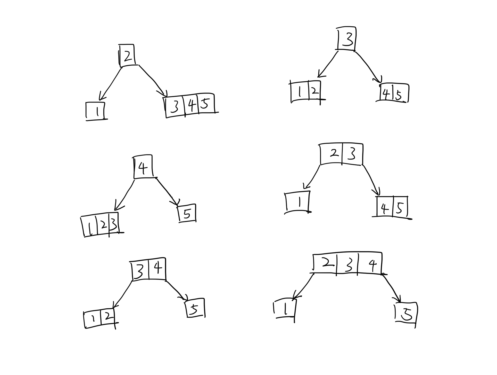
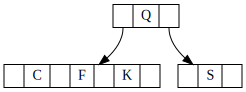
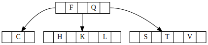
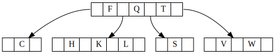
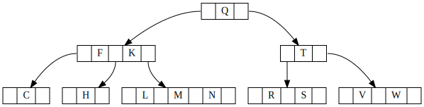
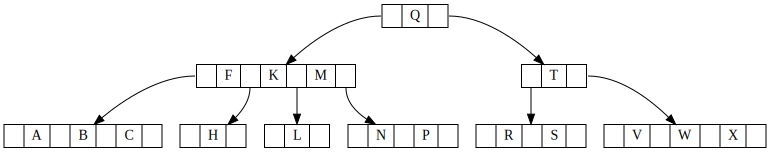
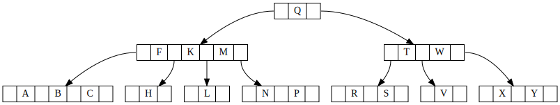
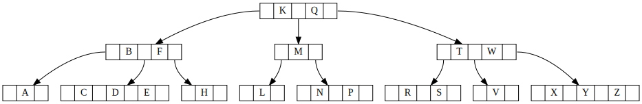

# Lab 5
## Q1
AVL tree is a kind of binary search tree with balance condition, which generally uses the difference of balance factor to determine whether it is balanced or not and achieves balance by rotation. It is a strictly balanced binary tree, and the balance condition must be satisfied (the height difference between the left and right subtrees of all nodes must not exceed 1). Regardless of whether we perform an insert or delete operation, as long as the above conditions are not met, we have to maintain the balance by rotation, which is very time-consuming, so we can see that AVL tree is suitable for the case where the number of insertions and deletions is small, but the number of lookups is large.

The B-tree can be seen as an extension to the binary search tree in that it allows M-1 children per node. It is a multinomial balanced search tree designed for efficient disk access. With the same number of nodes, the height of a B-tree is much less than the height of an AVL tree. The B-tree is a balanced tree where the height of each node to the leaf node is the same, which also ensures that each query is stable.

## Q2

## Q3
1. Insert F,Q,S
   
2. Insert K,C
   
3. Insert L,H,T,V
   
4. Insert W
   
5. Insert R,M,N
   
6. Insert P,A,B,X
   
7. Insert Y
   
8. Insert D,Z,E
   