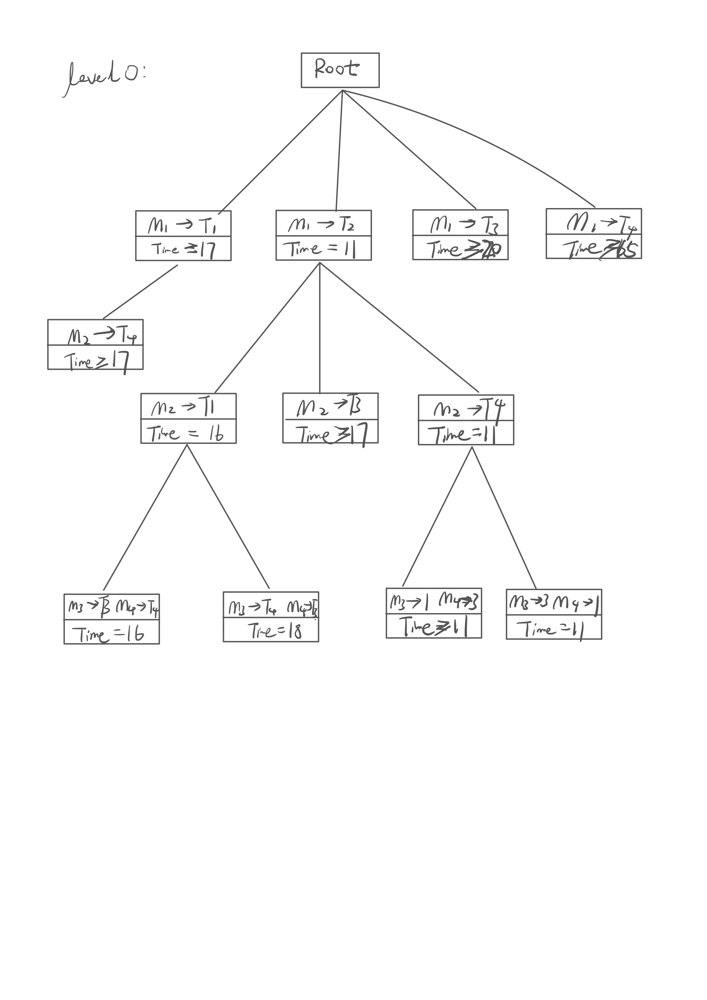

# Lab 7
## Task 1
```python
def totalNQueens(n):
    ans = 0
    solu = [0 for i in range(n)]

    def valid_solu(t) -> bool:
        for i in range(t):
            if abs(solu[i] - solu[t]) == abs(i - t) or solu[i] == solu[t]:
                return False
        return True

    def backtracing(t: int):
        if t >= n:
            nonlocal ans
            ans += 1
            return
        for i in range(n):
            solu[t] = i
            if valid_solu(t):
                backtracing(t + 1)

    backtracing(0)
    return ans

ans = totalNQueens(8)
print(ans)
```
The output is 92:

## Task 2
```pseudocode
/* findMinCost uses Least() and Add() to maintain the
   list of live nodes

   Least() finds a live node with least cost, deletes
   it from the list and returns it

   Add(x) calculates cost of x and adds it to the list
   of live nodes

   Implements list of live nodes as a min heap */


// Search Space Tree Node
node
{
   int task_number;
   int machine_number;
   node parent;
   int cost;
}

// Input: Cost Matrix of task Assignment problem
// Output: Optimal cost and Assignment of tasks
algorithm findMinCost (costMatrix mat[][])
{
   // Initialize list of live nodes(min-Heap)
   // with root of search tree i.e. a Dummy node
   while (true)
   {
      // Find a live node with least estimated cost
      E = Least();

      // The found node is deleted from the list
      // of live nodes
      if (E is a leaf node)
      {
         printSolution();
         return;
      }

     for each child x of E
     {
         Add(x); // Add x to list of live nodes;
         x->parent = E; // Pointer for path to root
     }
   }
} 
```
The binary and bound search tree is lake this.

So the assignment is:
Machine1 => Task2
Machine2 => Task4
Machine3 => Task3
Machine4 => Task1

The optimal total setup time is 11.