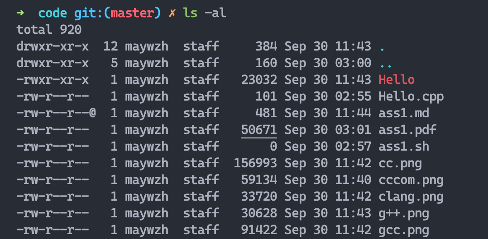
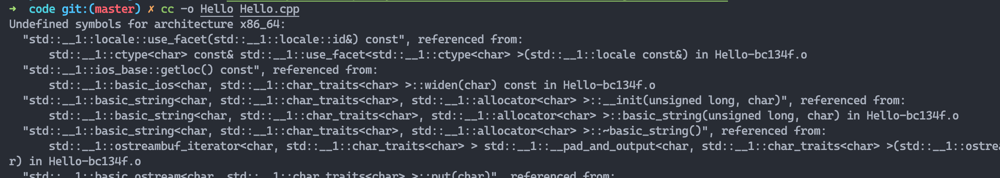
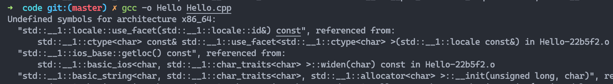
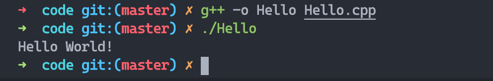

# CSCI851 Lab1
## Part One
```sh
cd /Users/maywzh/Workspace/ji_coursenotes/2020fall/CSCI851/assignment/ass1
mkdir code
cd code
ls -la
```
- clang


## Part Two
```cpp
#include <iostream>
using namespace std;
int main() {
  cout << "Hello World!" << endl;
  return 0;
}
```

```bash
cc Hello.cpp -o Hello
clang++ -std=c++1z Hello.cpp -o Hello
./Hello
```
- clang


- cc


- gcc


- g++
 
