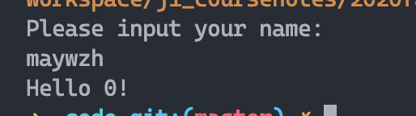
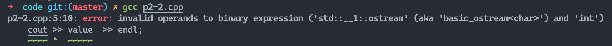
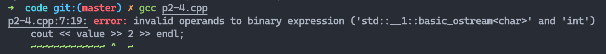
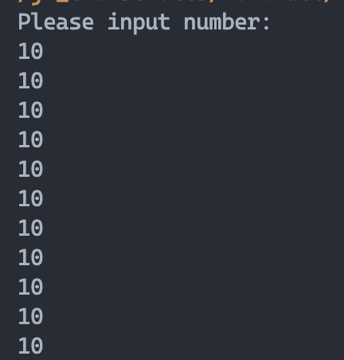
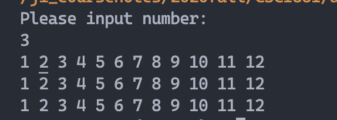

## Lab 2
### Part One
```cpp
#include <iostream>
using namespace std;
int main() {
    string name;
    cout << "Please input your name:" << endl;
    cin >> name;
    cout << "Hello " << name << "!" << endl;
    return 0;
}
```


```cpp
#include <iostream>
using namespace std;
int main() {
    float name;
    cout << "Please input your name:" << endl;
    cin >> name;
    cout << "Hello " << name << "!" << endl;
    return 0;
}
```


### Part Two
```cpp
int main(){
    cout << "Hello" << endl;
}
```

```cpp
#include <iostream>
using namespace std;
int main(){
    int value = 5;
    cout >> value  >> endl;
}
```

```cpp
#include <iostream>
using namespace std;
int main() {
    int value;
    cout << "Enter an integer : ";
    cin << value;
}
```

```cpp
#include<iostream>
using namespace std;
int main() {
    int value = 2;
    cout << value << 2 << endl;
    cout << (value << 2) << endl;
    cout << value >> 2 >> endl;
    cout << (value >> 2) >> endl;
}
```

```>>``` is binary expression can not be in ostream.

```endl```should be ostream rather than istream.


### Part Three
```cpp
//t3a.cpp
#include <iostream>
using namespace std;
int main() {
    string number;
    cout << "Please input number:" << endl;
    cin >> number;
    for (int i = 0;i < 10;i++) {
        cout << number << endl;
    }
    return 0;
}
```

```cpp
#include <iostream>
using namespace std;
int main() {
    int N;
    cout << "Please input number:" << endl;
    cin >> N;
    for (int i = 0;i < N;i++) {
        for (int j = 1;j <= 12;j++) {
            cout << j << ' ';
        }
        cout << endl;
    }
    return 0;
}
```


```cpp
#include <iostream>
using namespace std;
void printfunc(int N) {
    for (int i = 0;i < N;i++) {
        for (int j = 1;j <= 12;j++) {
            cout << j << ' ';
        }
        cout << endl;
    }
}
int main() {
    int N;
    cout << "Please input number:" << endl;
    cin >> N;
    printfunc(N);
    return 0;
}
```
