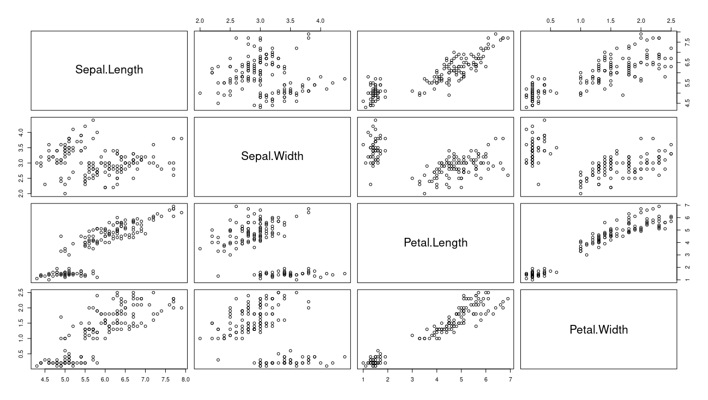
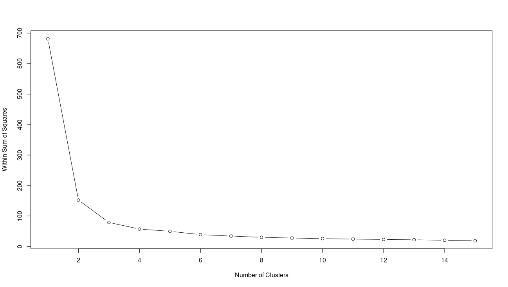
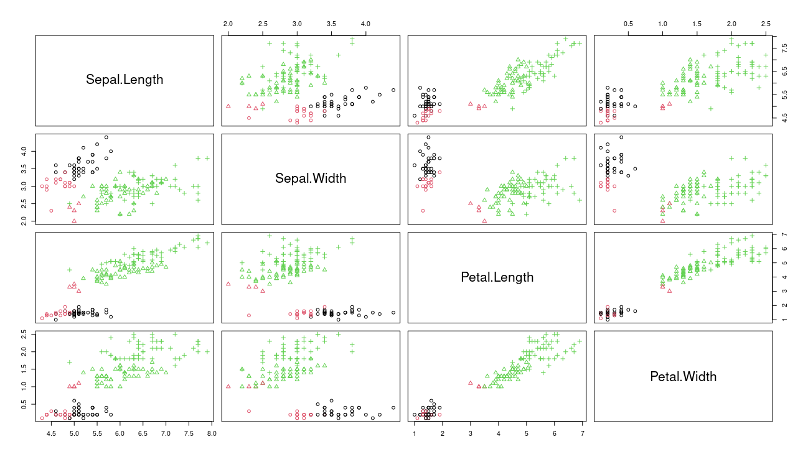
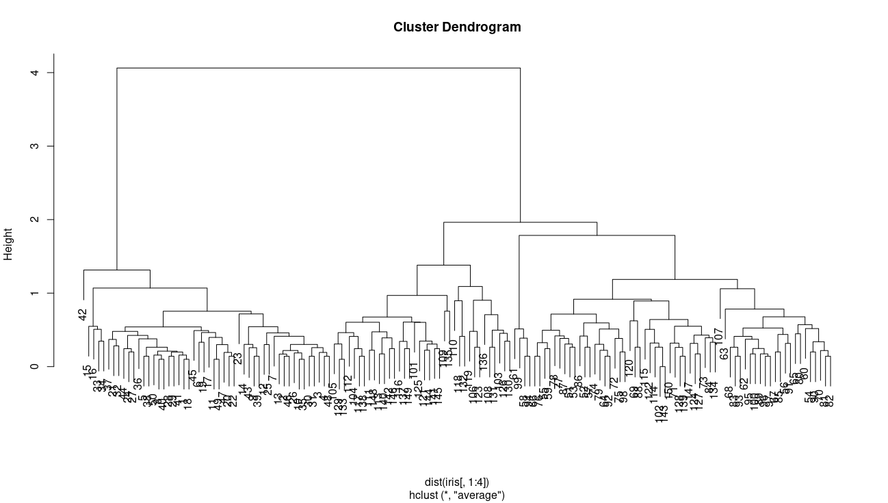
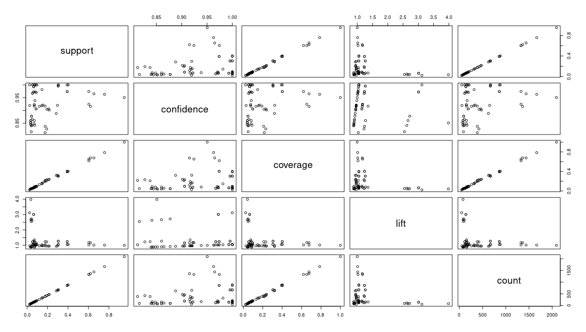
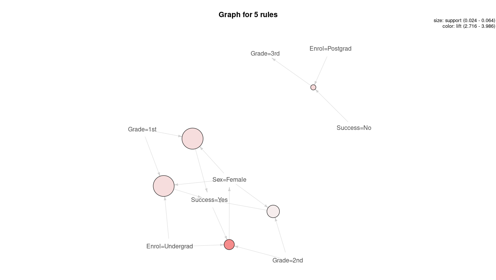

# Assignment 1
## Task 1 - Hypothesis Testing
- Null hypothesis
There will be no statistical difference with the mean of the performance scores under these three approaches.
- Alternative hypothesis
The mean of the performance scores of the two approaches are statistically different.

```R
> a1_pfm <- read.csv("./A1_performance_test.csv")
> model <- aov(performance ~ approach, data = a1_pfm)
> summary(model)
             Df Sum Sq Mean Sq F value Pr(>F)    
approach      2 203187  101594   111.9 <2e-16 ***
Residuals   597 541807     908                   
---
Signif. codes:  0 ‘***’ 0.001 ‘**’ 0.01 ‘*’ 0.05 ‘.’ 0.1 ‘ ’ 1
> TukeyHSD(model)
  Tukey multiple comparisons of means
    95% family-wise confidence level

Fit: aov(formula = performance ~ approach, data = a1_pfm)

$approach
                            diff         lwr       upr     p adj
approach2-approach1     5.959252  -0.9912349  12.90974 0.1095853
no_approach-approach1 -36.408222 -43.6650056 -29.15144 0.0000000
no_approach-approach2 -42.367474 -49.4460392 -35.28891 0.0000000
```
### 1.
We can see from the R console that two new teaching approaches have impact on the students' performance.
### 2.
The mean of approach 2  is (5.95) higher than the average value of approach 1. Therefore approach 2 can improve student learning performance more effectively.

### 3.
```R
#task1.r
a1_pfm <- read.csv("./A1_performance_test.csv")
model <- aov(performance ~ approach, data = a1_pfm)
summary(model)
TukeyHSD(model)

```


## Task 2 - Clustering
### 1. 
```R
> data("iris")
> dim(iris)
[1] 150   5
> head(iris)
  Sepal.Length Sepal.Width Petal.Length Petal.Width Species
1          5.1         3.5          1.4         0.2  setosa
2          4.9         3.0          1.4         0.2  setosa
3          4.7         3.2          1.3         0.2  setosa
4          4.6         3.1          1.5         0.2  setosa
5          5.0         3.6          1.4         0.2  setosa
6          5.4         3.9          1.7         0.4  setosa
> summary(iris)
  Sepal.Length    Sepal.Width     Petal.Length    Petal.Width          Species  
 Min.   :4.300   Min.   :2.000   Min.   :1.000   Min.   :0.100   setosa    :50  
 1st Qu.:5.100   1st Qu.:2.800   1st Qu.:1.600   1st Qu.:0.300   versicolor:50  
 Median :5.800   Median :3.000   Median :4.350   Median :1.300   virginica :50  
 Mean   :5.843   Mean   :3.057   Mean   :3.758   Mean   :1.199                  
 3rd Qu.:6.400   3rd Qu.:3.300   3rd Qu.:5.100   3rd Qu.:1.800                  
 Max.   :7.900   Max.   :4.400   Max.   :6.900   Max.   :2.500      
```
The dataset has a total of 150 data, each of which has 5 attributes (Length and width of Sepal, length and width of Petal, Species).

### 2.
```R
plot(iris[1:4])
```


### 3.
```R
> new_iris <- iris[,c(1,2,3,4)]
> plot(new_iris)
> wss<-numeric(15)
> for(k in 1:15) wss[k] <- sum(kmeans(new_iris,centers=k,nstart=25)$withinss)
> plot(1:15,wss,type="b",xlab="Number of Clusters",ylab="Within Sum of Squares")
```

k=3 for it is the elbow point of the curve.
### 4.
```R
> km<-kmeans(new_iris,3)
> View(km)
> plot(iris[c(1,2,3,4)],col=km$cluster,pch=as.integer(iris$Species))
```

So from the plot we can draw conclusion for the questions:
#### a. 
Yes
#### b. 
No
#### c.
No

### 5. 
```R
> library(e1071)
> m<-hclust(dist(iris[,1:4]),method="ave")
> plot(m)
> clusters=cutree(m,3)
> table(clusters,iris$Species)
        
clusters setosa versicolor virginica
       1     50          0         0
       2      0         50        14
       3      0          0        36
```

K-means has clearer results.

### 6.
```R
#task2.r
library(plyr)
library(ggplot2)
library(cluster)
library(lattice)
library(graphics)
library(grid)
library(gridExtra)
library(ggthemes)
library(e1071)
data("iris")
dim(iris)
head(iris)
summary(iris)
plot(iris[1:4])
new_iris <- iris[,c(1,2,3,4)]
plot(new_iris)
wss<-numeric(15)
for(k in 1:15) wss[k] <- sum(kmeans(new_iris,centers=k,nstart=25)$withinss)
plot(1:15,wss,type="b",xlab="Number of Clusters",ylab="Within Sum of Squares")
km<-kmeans(new_iris,3)
View(km)
plot(iris[c(1,2,3,4)],col=km$cluster,pch=as.integer(iris$Species))
m<-hclust(dist(iris[,1:4]),method="ave")
plot(m)
clusters=cutree(m,3)
table(clusters,iris$Species)
```
## Task 3 - Association Rule
### 1.
```R
> #support=0.002
> itemsets1<-apriori(data,parameter=list(minlen=1,support=0.002,target="rule"))
Apriori

Parameter specification:
 confidence minval smax arem  aval originalSupport maxtime support minlen maxlen target  ext
        0.8    0.1    1 none FALSE            TRUE       5   0.002      1     10  rules TRUE

Algorithmic control:
 filter tree heap memopt load sort verbose
    0.1 TRUE TRUE  FALSE TRUE    2    TRUE

Absolute minimum support count: 4 

set item appearances ...[0 item(s)] done [0.00s].
set transactions ...[10 item(s), 2201 transaction(s)] done [0.00s].
sorting and recoding items ... [10 item(s)] done [0.00s].
creating transaction tree ... done [0.00s].
checking subsets of size 1 2 3 4 done [0.00s].
writing ... [77 rule(s)] done [0.00s].
creating S4 object  ... done [0.00s].
Warning message:
Column(s) 1, 2, 3, 4 not logical or factor. Applying default discretization (see '? discretizeDF'). 
> summary(itemsets1)
set of 77 rules

rule length distribution (lhs + rhs):sizes
 1  2  3  4 
 1 10 35 31 

   Min. 1st Qu.  Median    Mean 3rd Qu.    Max. 
  1.000   3.000   3.000   3.247   4.000   4.000 

summary of quality measures:
    support           confidence        coverage             lift            count       
 Min.   :0.002272   Min.   :0.8130   Min.   :0.002272   Min.   :0.8834   Min.   :   5.0  
 1st Qu.:0.036347   1st Qu.:0.8774   1st Qu.:0.042253   1st Qu.:1.0000   1st Qu.:  80.0  
 Median :0.069968   Median :0.9385   Median :0.075875   Median :1.0521   Median : 154.0  
 Mean   :0.151950   Mean   :0.9333   Mean   :0.161302   Mean   :1.4820   Mean   : 334.4  
 3rd Qu.:0.191731   3rd Qu.:1.0000   3rd Qu.:0.216265   3rd Qu.:1.2659   3rd Qu.: 422.0  
 Max.   :0.950477   Max.   :1.0000   Max.   :1.000000   Max.   :3.9855   Max.   :2092.0  

mining info:
 data ntransactions support confidence
 data          2201   0.002        0.8
> inspect(itemsets1[0:5])
    lhs             rhs               support   confidence coverage  lift      count
[1] {}           => {Enrol=Undergrad} 0.9504771 0.9504771  1.0000000 1.0000000 2092 
[2] {Grade=2nd}  => {Enrol=Undergrad} 0.1185825 0.9157895  0.1294866 0.9635051  261 
[3] {Grade=1st}  => {Enrol=Undergrad} 0.1449341 0.9815385  0.1476602 1.0326798  319 
[4] {Sex=Female} => {Enrol=Undergrad} 0.1930940 0.9042553  0.2135393 0.9513700  425 
[5] {Grade=3rd}  => {Enrol=Undergrad} 0.2848705 0.8881020  0.3207633 0.9343750  627 
> #support=0.02
> itemsets2<-apriori(data,parameter=list(minlen=1,support=0.02,target="rule"))
Apriori

Parameter specification:
 confidence minval smax arem  aval originalSupport maxtime support minlen maxlen target  ext
        0.8    0.1    1 none FALSE            TRUE       5    0.02      1     10  rules TRUE

Algorithmic control:
 filter tree heap memopt load sort verbose
    0.1 TRUE TRUE  FALSE TRUE    2    TRUE

Absolute minimum support count: 44 

set item appearances ...[0 item(s)] done [0.00s].
set transactions ...[10 item(s), 2201 transaction(s)] done [0.00s].
sorting and recoding items ... [10 item(s)] done [0.00s].
creating transaction tree ... done [0.00s].
checking subsets of size 1 2 3 4 done [0.00s].
writing ... [63 rule(s)] done [0.00s].
creating S4 object  ... done [0.00s].
Warning message:
Column(s) 1, 2, 3, 4 not logical or factor. Applying default discretization (see '? discretizeDF'). 
> summary(itemsets2)
set of 63 rules

rule length distribution (lhs + rhs):sizes
 1  2  3  4 
 1 10 30 22 

   Min. 1st Qu.  Median    Mean 3rd Qu.    Max. 
  1.000   3.000   3.000   3.159   4.000   4.000 

summary of quality measures:
    support          confidence        coverage            lift            count       
 Min.   :0.02363   Min.   :0.8130   Min.   :0.02363   Min.   :0.8834   Min.   :  52.0  
 1st Qu.:0.05452   1st Qu.:0.8774   1st Qu.:0.05725   1st Qu.:0.9675   1st Qu.: 120.0  
 Median :0.08723   Median :0.9222   Median :0.08905   Median :1.0521   Median : 192.0  
 Mean   :0.18415   Mean   :0.9279   Mean   :0.19552   Mean   :1.2975   Mean   : 405.3  
 3rd Qu.:0.25057   3rd Qu.:0.9779   3rd Qu.:0.27215   3rd Qu.:1.2298   3rd Qu.: 551.5  
 Max.   :0.95048   Max.   :1.0000   Max.   :1.00000   Max.   :3.9855   Max.   :2092.0  

mining info:
 data ntransactions support confidence
 data          2201    0.02        0.8
> inspect(itemsets2[0:5])
    lhs             rhs               support   confidence coverage  lift      count
[1] {}           => {Enrol=Undergrad} 0.9504771 0.9504771  1.0000000 1.0000000 2092 
[2] {Grade=2nd}  => {Enrol=Undergrad} 0.1185825 0.9157895  0.1294866 0.9635051  261 
[3] {Grade=1st}  => {Enrol=Undergrad} 0.1449341 0.9815385  0.1476602 1.0326798  319 
[4] {Sex=Female} => {Enrol=Undergrad} 0.1930940 0.9042553  0.2135393 0.9513700  425 
[5] {Grade=3rd}  => {Enrol=Undergrad} 0.2848705 0.8881020  0.3207633 0.9343750  627 
> #support=0.2
> itemsets3<-apriori(data,parameter=list(minlen=1,support=0.2,target="rule"))
Apriori

Parameter specification:
 confidence minval smax arem  aval originalSupport maxtime support minlen maxlen target  ext
        0.8    0.1    1 none FALSE            TRUE       5     0.2      1     10  rules TRUE

Algorithmic control:
 filter tree heap memopt load sort verbose
    0.1 TRUE TRUE  FALSE TRUE    2    TRUE

Absolute minimum support count: 440 

set item appearances ...[0 item(s)] done [0.00s].
set transactions ...[10 item(s), 2201 transaction(s)] done [0.00s].
sorting and recoding items ... [7 item(s)] done [0.00s].
creating transaction tree ... done [0.00s].
checking subsets of size 1 2 3 4 done [0.00s].
writing ... [18 rule(s)] done [0.00s].
creating S4 object  ... done [0.00s].
Warning message:
Column(s) 1, 2, 3, 4 not logical or factor. Applying default discretization (see '? discretizeDF'). 
> summary(itemsets3)
set of 18 rules

rule length distribution (lhs + rhs):sizes
1 2 3 4 
1 7 8 2 

   Min. 1st Qu.  Median    Mean 3rd Qu.    Max. 
  1.000   2.000   3.000   2.611   3.000   4.000 

summary of quality measures:
    support         confidence        coverage           lift            count       
 Min.   :0.2099   Min.   :0.8881   Min.   :0.2317   Min.   :0.9344   Min.   : 462.0  
 1st Qu.:0.3044   1st Qu.:0.9209   1st Qu.:0.3058   1st Qu.:1.0033   1st Qu.: 670.0  
 Median :0.3916   Median :0.9696   Median :0.3969   Median :1.0521   Median : 862.0  
 Mean   :0.4440   Mean   :0.9582   Mean   :0.4638   Mean   :1.0785   Mean   : 977.3  
 3rd Qu.:0.6038   3rd Qu.:0.9955   3rd Qu.:0.6449   3rd Qu.:1.1724   3rd Qu.:1329.0  
 Max.   :0.9505   Max.   :1.0000   Max.   :1.0000   Max.   :1.2659   Max.   :2092.0  

mining info:
 data ntransactions support confidence
 data          2201     0.2        0.8
> inspect(itemsets3[0:5])
    lhs              rhs               support   confidence coverage  lift      count
[1] {}            => {Enrol=Undergrad} 0.9504771 0.9504771  1.0000000 1.0000000 2092 
[2] {Grade=3rd}   => {Enrol=Undergrad} 0.2848705 0.8881020  0.3207633 0.9343750  627 
[3] {Success=Yes} => {Enrol=Undergrad} 0.2971377 0.9198312  0.3230350 0.9677574  654 
[4] {Grade=4th}   => {Sex=Male}        0.3916402 0.9740113  0.4020900 1.2384742  862 
[5] {Grade=4th}   => {Enrol=Undergrad} 0.4020900 1.0000000  0.4020900 1.0521033  885 
```

### 2.
Set support = 0.02
```R
> itemsets <-
+   apriori(data, parameter = list(
+     minlen = 1,
+     support = 0.02,
+     target = "rule"
+   ))
Apriori

Parameter specification:
 confidence minval smax arem  aval originalSupport maxtime support minlen maxlen target  ext
        0.8    0.1    1 none FALSE            TRUE       5    0.02      1     10  rules TRUE

Algorithmic control:
 filter tree heap memopt load sort verbose
    0.1 TRUE TRUE  FALSE TRUE    2    TRUE

Absolute minimum support count: 44 

set item appearances ...[0 item(s)] done [0.00s].
set transactions ...[10 item(s), 2201 transaction(s)] done [0.00s].
sorting and recoding items ... [10 item(s)] done [0.00s].
creating transaction tree ... done [0.00s].
checking subsets of size 1 2 3 4 done [0.00s].
writing ... [63 rule(s)] done [0.00s].
creating S4 object  ... done [0.00s].
Warning message:
Column(s) 1, 2, 3, 4 not logical or factor. Applying default discretization (see '? discretizeDF'). 
> rhs_success <-
+   subset(itemsets, (rhs %in% paste0("Success=", unique(data$Success))))
> inspect(rhs_success[0:5])
    lhs                                       rhs           support    confidence coverage   lift     count
[1] {Grade=2nd,Sex=Female}                 => {Success=Yes} 0.04225352 0.8773585  0.04815993 2.715986  93  
[2] {Grade=2nd,Sex=Male}                   => {Success=No}  0.06996820 0.8603352  0.08132667 1.270871 154  
[3] {Grade=1st,Sex=Female}                 => {Success=Yes} 0.06406179 0.9724138  0.06587915 3.010243 141  
[4] {Grade=3rd,Sex=Male}                   => {Success=No}  0.19173103 0.8274510  0.23171286 1.222295 422  
[5] {Grade=2nd,Sex=Female,Enrol=Undergrad} => {Success=Yes} 0.03634711 0.8602151  0.04225352 2.662916  80  
```

### 3.
```R
> plot(itemsets@quality)
> model_visual_lift<-head(sort(itemsets,by="lift"),5)
> plot(model_visual_lift,method='graph')
```



### 4.
```R
#task3.r
library(arules)
library(arulesViz)
data <- read.csv("./A1_success_data.csv")
#support=0.002
itemsets1 <-
  apriori(data, parameter = list(
    minlen = 1,
    support = 0.002,
    target = "rule"
  ))
summary(itemsets1)
inspect(itemsets1[0:5])
#support=0.02

itemsets2 <-
  apriori(data, parameter = list(
    minlen = 1,
    support = 0.02,
    target = "rule"
  ))
summary(itemsets2)
inspect(itemsets2[0:5])
#support=0.2
itemsets3 <-
  apriori(data, parameter = list(
    minlen = 1,
    support = 0.2,
    target = "rule"
  ))
summary(itemsets3)
inspect(itemsets3[0:5])
itemsets <-
  apriori(data, parameter = list(
    minlen = 1,
    support = 0.02,
    target = "rule"
  ))
rhs_success <-
  subset(itemsets, (rhs %in% paste0("Success=", unique(data$Success))))
inspect(rhs_success[0:5])
plot(itemsets@quality)
model_visual_lift<-head(sort(itemsets,by="lift"),5)
plot(model_visual_lift,method='graph')

```