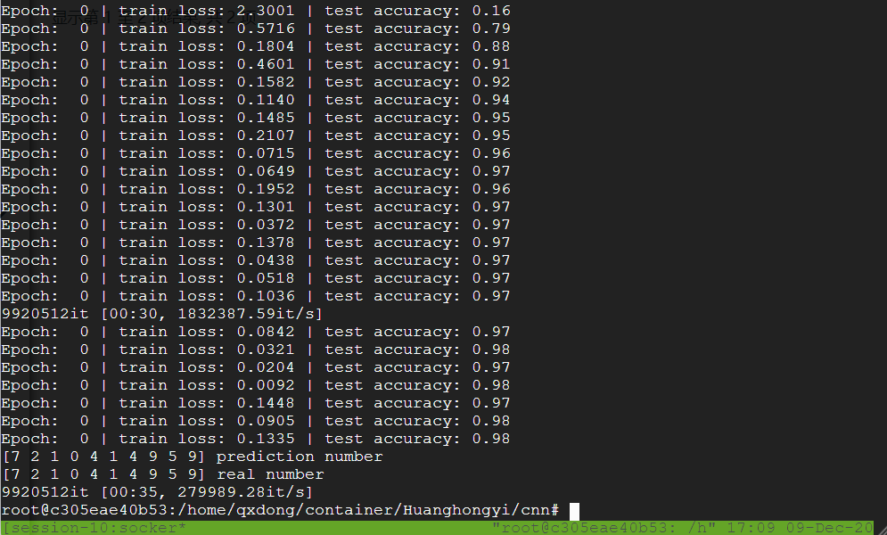
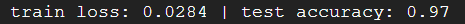
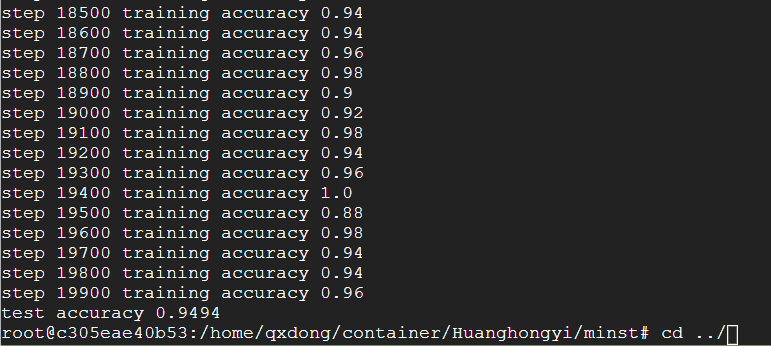

# Assignment 3

## Team Info and Contribution
Wangzhihui Mei 2019124044 6603385 25%
Hongyi Huang 2019180029 6642779 25%
Zijia He 2019124057 6603725 25%
Chang Xu 2019180034 6643048 25%

## Task1

### Question1 

The general structure of a traditional neural network is as follows:


Convolutional neural networks are still hierarchical networks, but the function and form of the layers have changed. 


A **Convolutional Neural Network (CNN)** is a Deep Learning algorithm which can take in an input image, assign importance (learnable weights and biases) to various aspects/objects in the image and be able to differentiate one from the other. The pre-processing required in a CNN Network is much lower as compared to other classification algorithms. While in primitive methods filters are hand-engineered, with enough training, CNN Networks have the ability to learn these filters/characteristics.

The architecture of a CNN is analogous to that of the connectivity pattern of Neurons in the Human Brain and was inspired by the organization of the Visual Cortex. Individual neurons respond to stimuli only in a restricted region of the visual field known as the Receptive Field. A collection of such fields overlap to cover the entire visual area.

CNNs can be thought of automatic feature extractors from the image. While if I use a algorithm with pixel vector I lose a lot of spatial interaction between pixels, a CNN effectively uses adjacent pixel information to effectively down sample the image first by convolution and then uses a prediction layer at the end.

### Question2

#### Convolutional layer

Computers read images as pixels and it is expressed as a matrix (NxNx3) — (height by width by depth). Images make use of three channels (RGB), so that is why we have a depth of 3.

The Convolutional Layer makes use of a set of learnable filters. A filter is used to detect the presence of specific features or patterns present in the original image (input). It is usually expressed as a matrix (MxMx3), with a smaller dimension but the same depth as the input file.

This filter is convolved across the width and height of the input file, and a dot product is computed to give an activation map. Different filters which detect different features are convolved on the input file and a set of activation maps is outputted which is passed to the next layer in the CNN

####  pooling layer

Pooling layer also known as under sampling or down sampling. Mainly used for feature downscaling, compressing the amount of data and parameters, reducing overfitting, and improving the fault tolerance of the model.

There are two operations in this layer; Average pooling and Maximum pooling

**Average-pooling** on average, we can define a spatial neighborhood (2*2 window) and compute the average value from the corrected feature map within the window.

**Max-pooling**, like the name states; will take out only the maximum from a pool. This is actually done with the use of filters sliding through the input; and at every stride, the maximum parameter is taken out and the rest is dropped. This actually down-samples the network.

### Question3

#### activation function

Adding some non-linearities to a neural network makes it better able to solve more complex problems.

####  epoch number

For training, a complete training of the model using all datasets is called an epoch.

#### batch size

Select a set of samples in the training set to update the weights. 1batch contains the number of samples, usually set to the nth power of 2, 4, 8,16, 32, 64, 125, 256.

#### learning rate

The output of the sample is fitted by propagating the output error backwards to the network parameters. This is essentially an optimization process that gradually moves toward an optimal solution. However, how much error is used in each update of the parameters is controlled by a parameter called the learning rate, also known as the step size.

####  momentum

Neural network momentum is a simple technique that often improves both training speed and accuracy. Training a neural network is the process of finding values for the weights and biases so that for a given set of input values, the computed output values closely match the known, correct, target values.


## Task 2

### MNIST Data Set

The MNIST data set comes from the National Institute of Standards and Technology (NIST). The training set is composed of 250 handwritten numbers from different people, 50% of which are high school students and 50% from the population Census Bureau (the Census Bureau) staff. The test set (test set) is the same proportion of handwritten digital data.Pictures are stored in bytes.The MNIST dataset is available at http://yann.lecun.com/exdb/mnist/, it contains four parts:

- Training set images: train-images-idx3-ubyte.gz (9.9 MB, 47 MB after decompression, containing 60,000 samples).
- Training set labels: train-labels-idx1-ubyte.gz (29 KB, 60 KB after decompression, containing 60,000 labels).
- Test set images: t10k-images-idx3-ubyte.gz (1.6 MB, 7.8 MB after decompression, including 10,000 samples).
- Test set labels: t10k-labels-idx1-ubyte.gz (5KB, 10 KB after decompression, containing 10,000 labels).


### Logistic Regression Classifier

Although Logistic Regression is called regression, it is actually a classification model and is often used for two classifications. Logistic Regression is loved by the industry because of its simplicity, parallelization, and strong interpretability. The essence of logistic regression is to assume that the data obey this distribution, and then use maximum likelihood estimation to estimate the parameters.

Logistic distribution is a continuous probability distribution, and its distribution function and density function are:

$F(x)=P(X \leq x)=\frac{1}{1+e^{-(x-\mu) / \gamma}}$
$f(x)=F^{\prime}(X \leq x)=\frac{e^{-(x-\mu) / \gamma}}{\gamma\left(1+e^{-(x-\mu) / \gamma}\right)^{2}}$

Among them, $\mu$ represents the positional parameter, and $\gamma>0$ is the shape parameter.We can look at its image characteristics:


We import the sklearn package to implement Logistic Regression Classifier.First, we download the data set and transform the data set.The downloaded file name and the corresponding relationship are as follows: train-images-idx3-ubyte: training set image, train-labels-idx1-ubyte: training set label, t10k-images-idx3-ubyte: test set image, t10k-labels -idx1-ubyte: Test set label.

```python
train_data = torchvision.datasets.MNIST(
    root='./mnist/',
    train=True,                                     
    transform=torchvision.transforms.ToTensor(),    
                                                   
    download=DOWNLOAD_MNIST,
)
```

For Logistic Regression Classifier settings are as follows:

```python
EPOCH = 50               # train the training data n times
BATCH_SIZE = 50
LR = 0.001              # learning rate
```

Process the training set and test set.


```python
train_loader = Data.DataLoader(dataset=train_data, batch_size=BATCH_SIZE, shuffle=True)
test_data = torchvision.datasets.MNIST(root='./mnist/', train=False)
print(train_data)
test_x = torch.unsqueeze(test_data.test_data, dim=1).type(torch.FloatTensor)[:2000]/255.   
test_y = test_data.test_labels[:2000]
```

The class of the training model.

```python
class logisticRg(nn.Module):
    def __init__(self):
        super(logisticRg, self).__init__()
        self.lr = nn.Sequential(
            nn.Linear(28*28,10)
        )

    def forward(self, x):
        output = self.lr(x)
        return output, x 
```

Train the model.

```python
lor = logisticRg()
test_output, last_layer = lor(test_x.view(-1,28*28))
pred_y = torch.max(test_output, 1)[1].data.numpy()
accuracy = float((pred_y == test_y.data.numpy()).astype(int).sum()) / float(test_y.size(0))
print('train loss: %.4f' % loss.data.numpy(), 'test accuracy: %.2f' % accuracy)
```

Output the results and make predictions on the test set.

```python
train loss: 0.1650 test accuracy: 0.91
train loss: 0.1983 test accuracy: 0.91
train loss: 0.2366 test accuracy: 0.91
train loss: 0.2702 test accuracy: 0.91
train loss: 0.2195 test accuracy: 0.90
```


### Multi-Class Linear Support Vector Machine

The Support Vector Classifier is based on the distribution of training samples to search for the best one among possible linear classifiers. The samples that determine the position of the classification boundary are not all training data, but are in the two category spaces. Two different types of data points with the smallest interval are called "support vectors". In this way, the few training samples that are most effective for the prediction task can be selected from the massive or even high-dimensional data.

The basic idea of SVM learning is to solve the separation hyperplane that can correctly divide the training data set and have the largest geometric interval. As shown in the figure below, $\boldsymbol{w} \cdot x+b=0$ is the separating hyperplane. For a linearly separable data set, there are infinitely many such hyperplanes (ie perceptrons), but The separating hyperplane with the largest geometrical interval is unique.


We use sklearn to implement SVM.We get the processed mnist data set from the data set that comes with sklearn.

```python
import numpy as np
from sklearn import svm
from sklearn.datasets  import load_digits
from sklearn.model_selection  import train_test_split
mnist = load_digits()
```

We extract a quarter of the data set as the test set, and the other three quarters as the training set.

```python
x,test_x,y,test_y = train_test_split(mnist.data,mnist.target,test_size=0.25,random_state=40)
```

There are some important parameters in the SVM classifier, as shown below.

- **Penalty** : Specify the specifications used in the penalty. The'l2' penalty is the standard used in SVC. 'l1' results in a sparse coef_ vector.
- **Loss**  : Specify the loss function. "Hinge" is the standard SVM loss (for example used by the SVC class), and "squared_hinge" is the squared of the hinge loss.
- **C** : The penalty parameter for the error item.
- **Multi_class** : If y contains more than two classes, a multi-class strategy is determined. 
- **Random_state** : 'poly','sigmoid'; the constant term of the kernel function.
- **Max_iter**  : The maximum number of iterations to run.

Parameters used in this model：

```pyt
model = svm.LinearSVC(penalty='l2', loss='squared_hinge', C=1.5, multi_class='ovr',fit_intercept=True, random_state=None,max_iter=5000)
```

Train the model and output the prediction results：

```python
svmmodel=model.fit(x, y)
z = model.predict(test_x)
print('acc:',np.sum(z==test_y)/z.size)
acc: 0.9355555555555556
```

### CNN

In deep learning, a convolutional neural network (CNN, or ConvNet) is a class of deep neural networks, most commonly applied to analyzing visual imagery.[1] They are also known as shift invariant or space invariant artificial neural networks (SIANN), based on their shared-weights architecture and translation invariance characteristics. They have applications in image and video recognition, recommender systems,image classification, medical image analysis, natural language processing,brain-computer interfaces,and financial time series.

CNNs are regularized versions of multilayer perceptrons. Multilayer perceptrons usually mean fully connected networks, that is, each neuron in one layer is connected to all neurons in the next layer. The "fully-connectedness" of these networks makes them prone to overfitting data. Typical ways of regularization include adding some form of magnitude measurement of weights to the loss function. CNNs take a different approach towards regularization: they take advantage of the hierarchical pattern in data and assemble more complex patterns using smaller and simpler patterns. Therefore, on the scale of connectedness and complexity, CNNs are on the lower extreme.

Convolutional networks were inspired by biological processesin that the connectivity pattern between neurons resembles the organization of the animal visual cortex. Individual cortical neurons respond to stimuli only in a restricted region of the visual field known as the receptive field. The receptive fields of different neurons partially overlap such that they cover the entire visual field.

CNNs use relatively little pre-processing compared to other image classification algorithms. This means that the network learns the filters that in traditional algorithms were hand-engineered. This independence from prior knowledge and human effort in feature design is a major advantage.


### CNN A
Two convolutional layer and two pooling layer are used in network design.
```python
x_image = tf.reshape(x, [-1, 28, 28, 1])  # Convert the input data shape so that it can be used in the network
W_conv1 = weight_variable([5, 5, 1, 32])
b_conv1 = bias_variable([32])
h_conv1 = tf.nn.relu(conv2d(x_image, W_conv1) + b_conv1)  # First convolutional layer
h_pool1 = max_pool(h_conv1)  # The first pooling layer

W_conv2 = weight_variable([5, 5, 32, 64])
b_conv2 = bias_variable([64])
h_conv2 = tf.nn.relu(conv2d(h_pool1, W_conv2) + b_conv2)  # Second convolutional layer
h_pool2 = max_pool(h_conv2)  # The second pooling layer

W_fc1 = weight_variable([7 * 7 * 64, 1024])
b_fc1 = bias_variable([1024])
h_pool2_flat = tf.reshape(h_pool2, [-1, 7 * 7 * 64])  # reshape into vector
h_fc1 = tf.nn.relu(tf.matmul(h_pool2_flat, W_fc1) + b_fc1)  # The first fully connected layer
```
result:

### CNN B

In the machine learning model, if the model has too many parameters and too few training samples, the trained model is likely to have overfitting phenomenon. The problem of fitting is often encountered in the training of neural network. The specific performance of overfitting is as follows: the loss function of the model on the training data is small, and the prediction accuracy is high; However, in the test data, the loss function is relatively large and the prediction accuracy is low.

Overfitting is a common problem in many machine learning. If the model overfits, the resulting model is almost useless. In order to solve the problem of overfitting, the method of model integration is generally adopted, that is, multiple models are trained to combine. At this point, the training model becomes a big problem. It is not only time-consuming to train multiple models, but also time-consuming to test multiple models.

To sum up, when training deep neural network, there are always two major shortcomings:

(1) Easy overfitting

(2) Time consuming

Dropout can effectively alleviate the occurrence of overfitting and achieve regularization effect to a certain extent.

code:
```python
keep_prob = tf.placeholder("float")
h_fc1_drop = tf.nn.dropout(h_fc1, keep_prob)  # dropout layer

W_fc2 = weight_variable([1024, 10])
b_fc2 = bias_variable([10])
y_predict = tf.nn.softmax(tf.matmul(h_fc1, W_fc1) + b_fc1)  # softmax layer
y_predict = tf.nn.softmax(tf.matmul(h_fc1_drop, W_fc2) + b_fc2)  # softmax layer

cross_entropy = -tf.reduce_sum(y_actual * tf.log(y_predict))  # Cross entropy
train_step = tf.train.GradientDescentOptimizer(1e-3).minimize(cross_entropy)  # Gradient descent
correct_prediction = tf.equal(tf.argmax(y_predict, 1), tf.argmax(y_actual, 1))
accuracy = tf.reduce_mean(tf.cast(correct_prediction, "float"))  # Accuracy calculation
```
result:



### CNN C

Tensor image data batches are generated by real-time data enhancement and can be iterated iteratively. We know that in Keras, we need to use the model.fit_generator() method when there is a large amount of data, and the first parameter accepted by the method is a generator. Is simply: ImageDataGenerator () is keras. The preprocessing, the image the image generator module, "hello" to each model the size of a batch_size sample data, at the same time also can be in each batch to enhance the batch_size sample data, expand the data set size, strengthen the generalization ability of the model. You can rotate, you can deform, you can normalize and so on.

code:

```python
from tensorflow.keras.preprocessing.image import ImageDataGenerator


mnist = tf.keras.datasets.mnist
(x_train, y_train), (x_test, y_test) = mnist.load_data()
x_train, x_test = x_train / 255.0, x_test / 255.0
x_train = x_train.reshape(x_train.shape[0], 28, 28, 1)
image_gen_train = ImageDataGenerator(
    rescale=1. / 1.,  # If it is an image, when the denominator is 255, it can be classified to 0～1
    rotation_range=45,  # Random 45 degree rotation
    width_shift_range=.15,  # Width offset
    height_shift_range=.15,  # Height offset
    horizontal_flip=False,  # horizontal flip
    zoom_range=0.5  # Randomly scale the image by 50%
)
image_gen_train.fit(x_train)
```

result:



### Conclusion
In terms of accuracy performance, both SVM and LRC have less effect than CNN, but with the increase of epoch, the accuracy of LRC will increase significantly. Compared with the three CNNS, the effect difference is not very big. At the beginning, the performance strength of CNN C is only about 80%, and after repeated reference, it returns to a better effect compared with the other two CNNS. It shows that CNN is superior to the traditional machine learning algorithm in image recognition.


## Task3 

### Use the pre-trained Inception-BatchNorm network to classify object images.
Load packages
```r
require(mxnet)
require(imager)
```
Load models and mean image
```r
model = mx.model.load("Inception/Inception_BN", iteration=39)
mean.img = as.array(mx.nd.load("Inception/mean_224.nd")[["mean_img"]])
```
Classify the image
Now we are ready to classify the image! Use the predict function to get the probability over classes:

```r
prob <- predict(model, X=normed)
dim(prob)
```
```text
## [1] 1000    1
```
Use the max.col on the transpose of prob to get the class index:
```r
max.idx <- max.col(t(prob))
max.idx
```
```text
## [1] 89
```
read and print category name
```r
synsets <- readLines("Inception/synset.txt")
print(paste0("Predicted Top-class: ", synsets  [[max.idx]]))
```
```text
## [1] "Predicted Top-class: n01818515 macaw"
```

### The Caltech 256 datasets

The Caltech 256 is considered an improvement to its predecessor, the Caltech 101 dataset, with new features such as larger category sizes, new and larger clutter categories, and overall increased difficulty. This is a great dataset to train models for visual recognition. There are 30,607 images in this dataset spanning 257 object categories. Object categories are extremely diverse, ranging from grasshopper to tuning fork. The distribution of images per category are:

- Min: 80
- Med: 100
- Mean: 119
- Max: 827

### Extract feature representation for each image

Load and plot the image:

```r
im <- load.image(system.file("extdata/parrots.png", package="imager"))
plot(im)
```

Before feeding the image to the deep network, we need to perform some preprocessing to make the image meet the deep network input requirements. Preprocessing includes cropping and subtracting the mean. Because MXNet is deeply integrated with R, we can do all the processing in an R function:

```r
preproc.image <- function(im, mean.image) {
    # crop the image
    shape <- dim(im)
    short.edge <- min(shape[1:2])
    xx <- floor((shape[1] - short.edge) / 2)
    yy <- floor((shape[2] - short.edge) / 2)
    cropped <- crop.borders(im, xx, yy)
    # resize to 224 x 224, needed by input of the model.
    resized <- resize(cropped, 224, 224)
    # convert to array (x, y, channel)
    arr <- as.array(resized) * 255
    dim(arr) <- c(224, 224, 3)
    # subtract the mean
    normed <- arr - mean.img
    # Reshape to format needed by mxnet (width, height, channel, num)
    dim(normed) <- c(224, 224, 3, 1)
    return(normed)
}
```

Use the defined preprocessing function to get the normalized image:

```r
normed <- preproc.image(im, mean.img)
```


