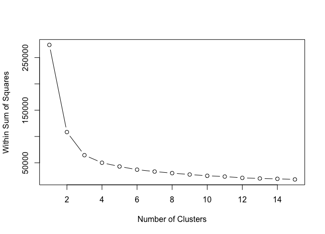
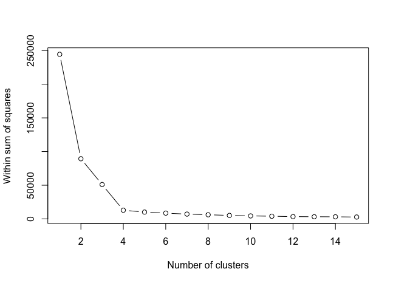
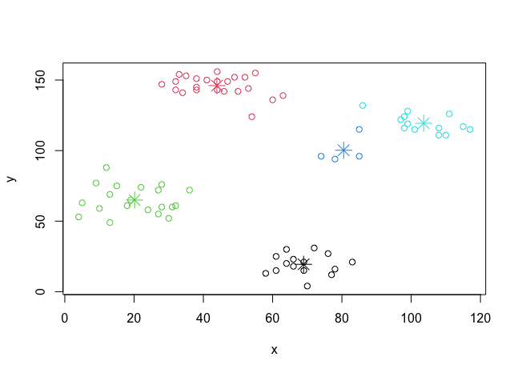

# Lab Week 4
## Task One
```R
> library(plyr)
> library(ggplot2)
> library(cluster)
> library(lattice)
> library(graphics)
> library(grid)
> library(gridExtra)
> library(ggthemes)
> grade_input = as.data.frame(read.csv('./grades_km_input.csv'))
> kmdata_orig = as.matrix(grade_input[,c('Student','English','Math','Science')])
> kmdata<-kmdata_orig[,2:4]
> View(kmdata)
> wss <- numeric(15)
> for (k in 1:15) wss[k] <- sum(kmeans(kmdata,centers=k,nstart=25)$withinss)
> plot(1:15,wss,type='b',xlab='Number of Clusters', ylab='Within Sum of Squares')
> km=kmeans(kmdata,3,nstart=25)
> km
K-means clustering with 3 clusters of sizes 218, 244, 158

Cluster means:
   English     Math  Science
1 73.22018 64.62844 65.84862
2 85.84426 79.68033 81.50820
3 97.21519 93.37342 94.86076

Clustering vector:
  [1] 3 3 3 3 3 3 3 3 3 3 3 3 3 3 3 3 3 3 3 3 3 3 3 3 3 3 3 3 3 3 3 3 3 3 3 3 3 3 3 3 3 3 3 3 3 3 3
 [48] 3 3 3 3 3 3 3 3 3 3 3 3 3 3 3 3 3 3 3 3 3 3 3 3 3 3 3 3 3 3 3 3 3 3 3 3 3 3 3 3 3 3 3 3 3 3 3
 [95] 3 3 3 3 3 3 3 3 3 3 3 3 3 3 3 3 3 3 3 3 3 3 3 3 3 3 3 3 3 3 3 3 3 3 3 3 3 3 3 3 3 3 3 3 3 3 3
[142] 3 3 3 3 3 3 3 3 3 2 2 2 2 2 2 2 2 2 2 2 2 2 2 2 2 3 2 2 2 2 2 2 2 2 2 2 3 3 2 2 3 2 2 2 3 2 2
[189] 2 2 2 2 3 2 2 2 2 2 2 2 2 2 2 2 2 2 2 2 2 2 2 2 2 2 2 2 2 2 2 2 2 2 2 2 2 2 2 2 2 2 2 2 2 2 2
[236] 2 2 2 2 2 2 2 2 2 2 2 2 2 2 2 2 2 2 2 2 2 2 2 2 2 2 2 2 2 2 2 2 2 2 2 2 2 2 2 2 2 2 2 2 2 2 2
[283] 2 2 2 2 2 2 2 2 2 2 2 2 2 2 2 2 2 2 2 2 2 2 2 2 2 2 2 2 2 2 2 2 2 2 2 2 2 2 2 2 2 2 2 2 2 2 2
[330] 2 2 2 2 2 2 2 2 2 2 2 2 2 2 2 2 2 2 2 2 2 2 2 2 2 2 2 2 2 2 2 2 2 2 2 2 2 2 2 2 2 2 2 2 2 2 2
[377] 1 1 1 1 1 1 1 2 1 2 1 2 2 2 1 1 1 1 2 2 1 1 1 1 1 1 1 1 1 1 1 1 1 1 1 1 1 1 1 1 1 1 1 1 1 1 1
[424] 1 1 1 1 1 1 1 1 1 1 1 1 1 1 1 1 1 1 1 1 1 1 1 2 1 1 1 1 1 1 1 1 1 1 1 1 1 1 1 1 1 1 2 1 1 1 2
[471] 1 1 1 1 1 1 1 1 2 1 1 1 1 1 1 1 1 1 1 1 1 1 1 1 1 1 1 1 1 1 1 1 1 1 1 1 1 1 1 1 1 1 1 1 1 1 1
[518] 1 1 1 1 1 1 1 1 1 1 1 1 1 1 1 1 1 1 1 1 1 1 1 1 1 1 1 1 1 1 1 1 1 1 1 1 1 1 1 1 1 1 1 1 1 1 1
[565] 1 1 1 1 1 1 1 1 1 1 1 1 1 1 1 1 1 1 1 1 1 1 1 1 1 1 1 1 1 1 1 1 1 1 1 1 2 2 1 1 2 2 2 2 3 3 2
[612] 2 2 1 1 2 1 2 2 2

Within cluster sum of squares by cluster:
[1] 34806.339 22984.131  6692.589
 (between_SS / total_SS =  76.5 %)

Available components:

[1] "cluster"      "centers"      "totss"        "withinss"     "tot.withinss" "betweenss"   
[7] "size"         "iter"         "ifault"      
> c(wss[3],sum(km$withinss))
[1] 64483.06 64483.06
> save.image('task1.RData')
```
the elbow is 3, set k = 3



## Task Two
```R
> library(plyr)
> library(ggplot2)
> library(cluster)
> library(lattice)
> library(graphics)
> library(grid)
> library(gridExtra)
> library(ggthemes)
> grade_input = as.data.frame(read.csv('./grades_km_input.csv'))
> kmdata_orig = as.matrix(grade_input[,c('Student','English','Math','Science')])
> kmdata<-kmdata_orig[,2:4]
> View(kmdata)
> wss <- numeric(15)
> for (k in 1:15) wss[k] <- sum(kmeans(kmdata,centers=k,nstart=25)$withinss)
> plot(1:15,wss,type='b',xlab='Number of Clusters', ylab='Within Sum of Squares')
> km=kmeans(kmdata,3,nstart=25)
> km
K-means clustering with 3 clusters of sizes 158, 218, 244

Cluster means:
   English     Math  Science
1 97.21519 93.37342 94.86076
2 73.22018 64.62844 65.84862
3 85.84426 79.68033 81.50820

Clustering vector:
  [1] 1 1 1 1 1 1 1 1 1 1 1 1 1 1 1 1 1 1 1 1 1 1 1 1 1 1 1 1 1 1 1 1 1 1 1 1 1 1 1 1 1 1 1 1 1 1 1 1 1 1 1 1 1 1 1 1 1 1 1 1 1 1 1 1 1 1 1 1 1 1 1 1 1 1 1 1 1 1 1
 [80] 1 1 1 1 1 1 1 1 1 1 1 1 1 1 1 1 1 1 1 1 1 1 1 1 1 1 1 1 1 1 1 1 1 1 1 1 1 1 1 1 1 1 1 1 1 1 1 1 1 1 1 1 1 1 1 1 1 1 1 1 1 1 1 1 1 1 1 1 1 1 1 3 3 3 3 3 3 3 3
[159] 3 3 3 3 3 3 3 3 1 3 3 3 3 3 3 3 3 3 3 1 1 3 3 1 3 3 3 1 3 3 3 3 3 3 1 3 3 3 3 3 3 3 3 3 3 3 3 3 3 3 3 3 3 3 3 3 3 3 3 3 3 3 3 3 3 3 3 3 3 3 3 3 3 3 3 3 3 3 3
[238] 3 3 3 3 3 3 3 3 3 3 3 3 3 3 3 3 3 3 3 3 3 3 3 3 3 3 3 3 3 3 3 3 3 3 3 3 3 3 3 3 3 3 3 3 3 3 3 3 3 3 3 3 3 3 3 3 3 3 3 3 3 3 3 3 3 3 3 3 3 3 3 3 3 3 3 3 3 3 3
[317] 3 3 3 3 3 3 3 3 3 3 3 3 3 3 3 3 3 3 3 3 3 3 3 3 3 3 3 3 3 3 3 3 3 3 3 3 3 3 3 3 3 3 3 3 3 3 3 3 3 3 3 3 3 3 3 3 3 3 3 3 2 2 2 2 2 2 2 3 2 3 2 3 3 3 2 2 2 2 3
[396] 3 2 2 2 2 2 2 2 2 2 2 2 2 2 2 2 2 2 2 2 2 2 2 2 2 2 2 2 2 2 2 2 2 2 2 2 2 2 2 2 2 2 2 2 2 2 2 2 2 2 2 3 2 2 2 2 2 2 2 2 2 2 2 2 2 2 2 2 2 2 3 2 2 2 3 2 2 2 2
[475] 2 2 2 2 3 2 2 2 2 2 2 2 2 2 2 2 2 2 2 2 2 2 2 2 2 2 2 2 2 2 2 2 2 2 2 2 2 2 2 2 2 2 2 2 2 2 2 2 2 2 2 2 2 2 2 2 2 2 2 2 2 2 2 2 2 2 2 2 2 2 2 2 2 2 2 2 2 2 2
[554] 2 2 2 2 2 2 2 2 2 2 2 2 2 2 2 2 2 2 2 2 2 2 2 2 2 2 2 2 2 2 2 2 2 2 2 2 2 2 2 2 2 2 2 2 2 2 2 3 3 2 2 3 3 3 3 1 1 3 3 3 2 2 3 2 3 3 3

Within cluster sum of squares by cluster:
[1]  6692.589 34806.339 22984.131
 (between_SS / total_SS =  76.5 %)

Available components:

[1] "cluster"      "centers"      "totss"        "withinss"     "tot.withinss" "betweenss"    "size"         "iter"         "ifault"      
> c(wss[3],sum(km$withinss))
[1] 64483.06 64483.06
> df<-as.data.frame(kmdata)
> df$cluster<-factor(km$cluster)
> centers<-as.data.frame(km$centers)
> g1<-ggplot(data=df,aes(x=English[],y=Math[],color=cluster)) + geom_point() + theme(legend.position = "right") + geom_point(data=centers,aes(x=English[],y=Math[],color=as.factor(c(1,2,3))),size=10,alpha=.3,show.legend=FALSE)
> g2<-ggplot(data=df,aes(x=English[],y=Science[],color=cluster)) + geom_point() + theme(legend.position = "right") + geom_point(data=centers,aes(x=English[],y=Science[],color=as.factor(c(1,2,3))),size=10,alpha=.3,show.legend=FALSE)
> g3<-ggplot(data=df,aes(x=Math[],y=Science[],color=cluster)) + geom_point() + theme(legend.position = "right") + geom_point(data=centers,aes(x=Math[],y=Science[],color=as.factor(c(1,2,3))),size=10,alpha=.3,show.legend=FALSE)
> t<-ggplot_gtable(ggplot_build(g1))
> grid.arrange(arrangeGrob(g1+theme(legend.position = "right"),
+                          g2+theme(legend.position = "right"),
+                          g3+theme(legend.position = "right")))
> save.image('task1.RData')   
> save.image('task2.RData')
```
the elbow is 5, set k = 5



We can see the data is clustered.
