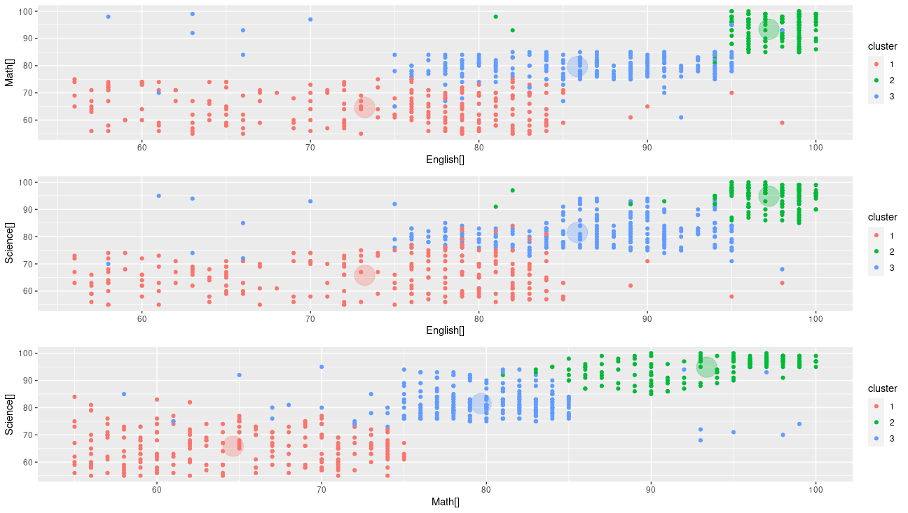

# Lab Week 4
## Task One
```R
> library(plyr)
> library(ggplot2)
> library(cluster)
> library(lattice)
> library(graphics)
> library(grid)
> library(gridExtra)
> library(ggthemes)
> grade_input = as.data.frame(read.csv('./grades_km_input.csv'))
> kmdata_orig = as.matrix(grade_input[,c('Student','English','Math','Science')])
> kmdata<-kmdata_orig[,2:4]
> View(kmdata)
> wss <- numeric(15)
> for (k in 1:15) wss[k] <- sum(kmeans(kmdata,centers=k,nstart=25)$withinss)
> plot(1:15,wss,type='b',xlab='Number of Clusters', ylab='Within Sum of Squares')
> km=kmeans(kmdata,3,nstart=25)
> km
K-means clustering with 3 clusters of sizes 218, 158, 244

Cluster means:
   English     Math  Science
1 73.22018 64.62844 65.84862
2 97.21519 93.37342 94.86076
3 85.84426 79.68033 81.50820

Clustering vector:
  [1] 2 2 2 2 2 2 2 2 2 2 2 2 2 2 2 2 2 2 2 2 2 2 2 2 2 2 2 2 2 2 2 2 2 2 2 2 2 2 2 2 2 2 2 2 2 2 2 2 2 2 2 2 2 2 2 2 2 2 2 2 2 2 2 2 2 2 2 2 2 2 2 2 2 2 2 2 2 2 2
 [80] 2 2 2 2 2 2 2 2 2 2 2 2 2 2 2 2 2 2 2 2 2 2 2 2 2 2 2 2 2 2 2 2 2 2 2 2 2 2 2 2 2 2 2 2 2 2 2 2 2 2 2 2 2 2 2 2 2 2 2 2 2 2 2 2 2 2 2 2 2 2 2 3 3 3 3 3 3 3 3
[159] 3 3 3 3 3 3 3 3 2 3 3 3 3 3 3 3 3 3 3 2 2 3 3 2 3 3 3 2 3 3 3 3 3 3 2 3 3 3 3 3 3 3 3 3 3 3 3 3 3 3 3 3 3 3 3 3 3 3 3 3 3 3 3 3 3 3 3 3 3 3 3 3 3 3 3 3 3 3 3
[238] 3 3 3 3 3 3 3 3 3 3 3 3 3 3 3 3 3 3 3 3 3 3 3 3 3 3 3 3 3 3 3 3 3 3 3 3 3 3 3 3 3 3 3 3 3 3 3 3 3 3 3 3 3 3 3 3 3 3 3 3 3 3 3 3 3 3 3 3 3 3 3 3 3 3 3 3 3 3 3
[317] 3 3 3 3 3 3 3 3 3 3 3 3 3 3 3 3 3 3 3 3 3 3 3 3 3 3 3 3 3 3 3 3 3 3 3 3 3 3 3 3 3 3 3 3 3 3 3 3 3 3 3 3 3 3 3 3 3 3 3 3 1 1 1 1 1 1 1 3 1 3 1 3 3 3 1 1 1 1 3
[396] 3 1 1 1 1 1 1 1 1 1 1 1 1 1 1 1 1 1 1 1 1 1 1 1 1 1 1 1 1 1 1 1 1 1 1 1 1 1 1 1 1 1 1 1 1 1 1 1 1 1 1 3 1 1 1 1 1 1 1 1 1 1 1 1 1 1 1 1 1 1 3 1 1 1 3 1 1 1 1
[475] 1 1 1 1 3 1 1 1 1 1 1 1 1 1 1 1 1 1 1 1 1 1 1 1 1 1 1 1 1 1 1 1 1 1 1 1 1 1 1 1 1 1 1 1 1 1 1 1 1 1 1 1 1 1 1 1 1 1 1 1 1 1 1 1 1 1 1 1 1 1 1 1 1 1 1 1 1 1 1
[554] 1 1 1 1 1 1 1 1 1 1 1 1 1 1 1 1 1 1 1 1 1 1 1 1 1 1 1 1 1 1 1 1 1 1 1 1 1 1 1 1 1 1 1 1 1 1 1 3 3 1 1 3 3 3 3 2 2 3 3 3 1 1 3 1 3 3 3

Within cluster sum of squares by cluster:
[1] 34806.339  6692.589 22984.131
 (between_SS / total_SS =  76.5 %)

Available components:

[1] "cluster"      "centers"      "totss"        "withinss"     "tot.withinss" "betweenss"    "size"         "iter"         "ifault"      
> c(wss[3],sum(km$withinss))
[1] 64483.06 64483.06
> df<-as.data.frame(kmdata)
> df$cluster<-factor(km$cluster)
> centers<-as.data.frame(km$centers)
> g1<-ggplot(data=df,aes(x=English[],y=Math[],color=cluster)) + geom_point() + theme(legend.position = "right") + geom_point(data=centers,aes(x=English[],y=Math[],color=as.factor(c(1,2,3))),size=10,alpha=.3,show.legend=FALSE)
> g2<-ggplot(data=df,aes(x=English[],y=Science[],color=cluster)) + geom_point() + theme(legend.position = "right") + geom_point(data=centers,aes(x=English[],y=Science[],color=as.factor(c(1,2,3))),size=10,alpha=.3,show.legend=FALSE)
> g3<-ggplot(data=df,aes(x=Math[],y=Science[],color=cluster)) + geom_point() + theme(legend.position = "right") + geom_point(data=centers,aes(x=Math[],y=Science[],color=as.factor(c(1,2,3))),size=10,alpha=.3,show.legend=FALSE)
> grid.arrange(arrangeGrob(g1+theme(legend.position = "right"),
+                          g2+theme(legend.position = "right"),
+                          g3+theme(legend.position = "right")))
> save.image('task1.RData')
```
the elbow is 3, set k = 3




## Task Two
```R
> library(plyr)
> library(ggplot2)
> library(cluster)
> library(lattice)
> library(graphics)
> library(grid)
> library(gridExtra)
> library(ggthemes)
> data(ruspini)
> wss<-numeric(15)
> for (k in 1:15) wss[k] <- sum(kmeans(ruspini,centers=k,nstart=25)$withinss)
> plot(1:15,wss,type='b',xlab='Number of clusters',ylab='Within sum of squares')
> km<-kmeans(ruspini,5)
> plot(ruspini[c('x','y')],col=km$cluster,pch=as.integer(ruspini$Species))
> points(km$centers[,c('x','y')],col=1:5,pch=8,cex=2)
> km$cluster
 1  2  3  4  5  6  7  8  9 10 11 12 13 14 15 16 17 18 19 20 21 22 23 24 25 26 27 28 29 30 31 32 33 34 35 36 37 38 39 40 41 42 43 44 45 46 47 48 49 50 51 52 53 54 
 5  5  5  2  5  2  2  2  5  5  2  2  2  5  5  5  5  5  5  2  4  4  4  4  4  4  4  4  4  4  4  4  4  4  4  4  4  4  4  4  4  4  4  3  3  3  3  3  3  3  3  3  3  3 
55 56 57 58 59 60 61 62 63 64 65 66 67 68 69 70 71 72 73 74 75 
 3  3  3  3  3  3  1  1  1  1  1  1  1  1  1  1  1  1  1  1  1 
> print(km)
K-means clustering with 5 clusters of sizes 15, 8, 17, 23, 12

Cluster means:
         x        y
1 68.93333  19.4000
2 20.25000  75.3750
3 98.17647 114.8824
4 43.91304 146.0435
5 20.08333  58.0000

Clustering vector:
 1  2  3  4  5  6  7  8  9 10 11 12 13 14 15 16 17 18 19 20 21 22 23 24 25 26 27 28 29 30 31 32 33 34 35 36 37 38 39 40 41 42 43 44 45 46 47 48 49 50 51 52 53 54 
 5  5  5  2  5  2  2  2  5  5  2  2  2  5  5  5  5  5  5  2  4  4  4  4  4  4  4  4  4  4  4  4  4  4  4  4  4  4  4  4  4  4  4  3  3  3  3  3  3  3  3  3  3  3 
55 56 57 58 59 60 61 62 63 64 65 66 67 68 69 70 71 72 73 74 75 
 3  3  3  3  3  3  1  1  1  1  1  1  1  1  1  1  1  1  1  1  1 

Within cluster sum of squares by cluster:
[1] 1456.533  859.375 4558.235 3176.783 1380.917
 (between_SS / total_SS =  95.3 %)

Available components:

[1] "cluster"      "centers"      "totss"        "withinss"     "tot.withinss" "betweenss"    "size"         "iter"         "ifault"      
> save.image('task2.RData')
```
the elbow is 5, set k = 5


We can see the data is clustered.
