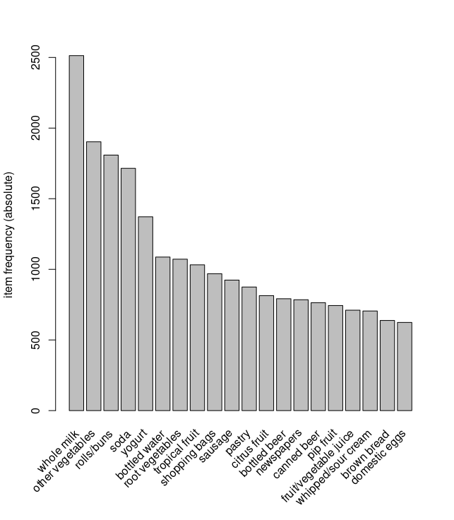
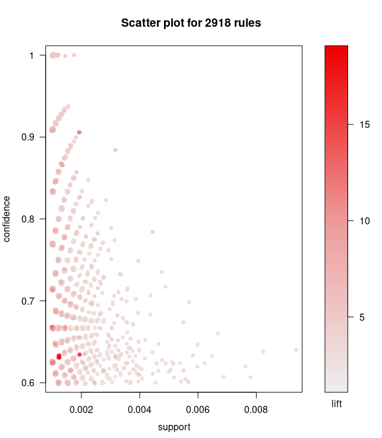
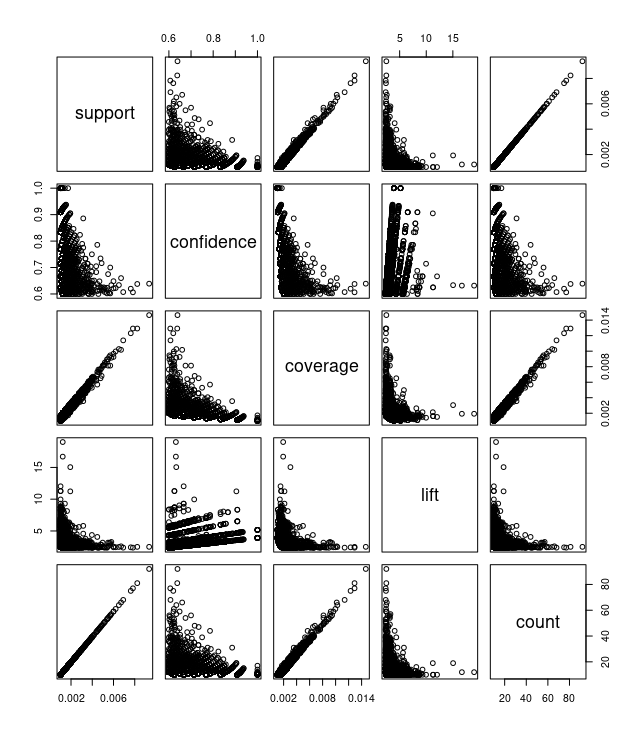
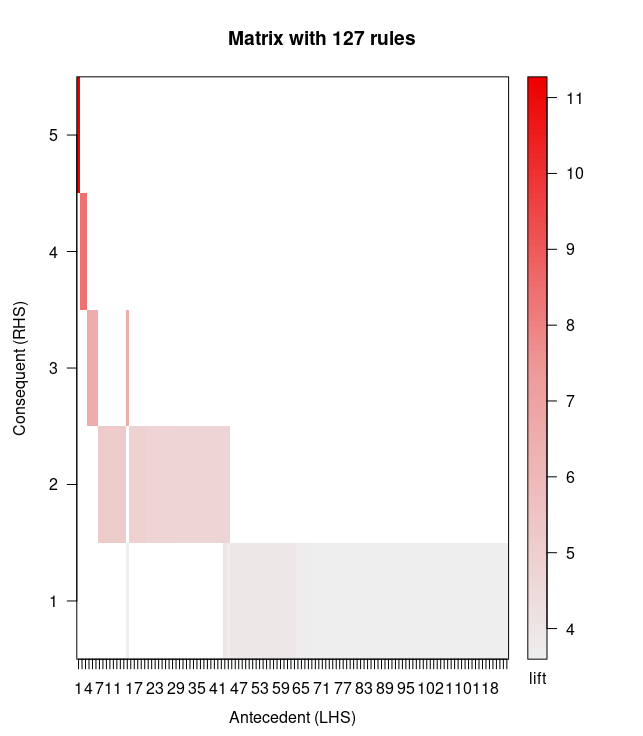
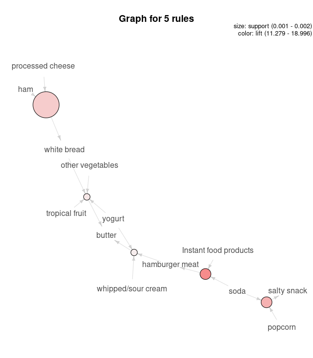

# Week5 lab
## Task One

```r
> library(arules) 
> data(Groceries)
> summary(Groceries)
transactions as itemMatrix in sparse format with
 9835 rows (elements/itemsets/transactions) and
 169 columns (items) and a density of 0.02609146 

most frequent items:
      whole milk other vegetables       rolls/buns             soda 
            2513             1903             1809             1715 
          yogurt          (Other) 
            1372            34055 

element (itemset/transaction) length distribution:
sizes
   1    2    3    4    5    6    7    8    9   10   11   12   13   14   15 
2159 1643 1299 1005  855  645  545  438  350  246  182  117   78   77   55 
  16   17   18   19   20   21   22   23   24   26   27   28   29   32 
  46   29   14   14    9   11    4    6    1    1    1    1    3    1 

   Min. 1st Qu.  Median    Mean 3rd Qu.    Max. 
  1.000   2.000   3.000   4.409   6.000  32.000 

includes extended item information - examples:
       labels  level2           level1
1 frankfurter sausage meat and sausage
2     sausage sausage meat and sausage
3  liver loaf sausage meat and sausage
> itemsets<-apriori(Groceries,parameter=list(minlen=1,support=0.02,maxlen=10,target='frequent itemsets')) # Generate frequent itemsets 
Apriori

Parameter specification:
 confidence minval smax arem  aval originalSupport maxtime support minlen
         NA    0.1    1 none FALSE            TRUE       5    0.02      1
 maxlen            target  ext
     10 frequent itemsets TRUE

Algorithmic control:
 filter tree heap memopt load sort verbose
    0.1 TRUE TRUE  FALSE TRUE    2    TRUE

Absolute minimum support count: 196 

set item appearances ...[0 item(s)] done [0.00s].
set transactions ...[169 item(s), 9835 transaction(s)] done [0.01s].
sorting and recoding items ... [59 item(s)] done [0.00s].
creating transaction tree ... done [0.01s].
checking subsets of size 1 2 3 done [0.00s].
sorting transactions ... done [0.00s].
writing ... [122 set(s)] done [0.00s].
creating S4 object  ... done [0.00s].
> rules<-apriori(Groceries,parameter=list(support=0.001,confidence=0.6,target="rules")) # Generate associate rules 
Apriori

Parameter specification:
 confidence minval smax arem  aval originalSupport maxtime support minlen
        0.6    0.1    1 none FALSE            TRUE       5   0.001      1
 maxlen target  ext
     10  rules TRUE

Algorithmic control:
 filter tree heap memopt load sort verbose
    0.1 TRUE TRUE  FALSE TRUE    2    TRUE

Absolute minimum support count: 9 

set item appearances ...[0 item(s)] done [0.00s].
set transactions ...[169 item(s), 9835 transaction(s)] done [0.01s].
sorting and recoding items ... [157 item(s)] done [0.00s].
creating transaction tree ... done [0.01s].
checking subsets of size 1 2 3 4 5 6 done [0.02s].
writing ... [2918 rule(s)] done [0.00s].
creating S4 object  ... done [0.00s].
> rules<-sort(rules, decreasing=TRUE,by="confidence")
> inspect(rules[1:5])
    lhs                     rhs              support confidence    coverage     lift count
[1] {rice,                                                                                
     sugar}              => {whole milk} 0.001220132          1 0.001220132 3.913649    12
[2] {canned fish,                                                                         
     hygiene articles}   => {whole milk} 0.001118454          1 0.001118454 3.913649    11
[3] {root vegetables,                                                                     
     butter,                                                                              
     rice}               => {whole milk} 0.001016777          1 0.001016777 3.913649    10
[4] {root vegetables,                                                                     
     whipped/sour cream,                                                                  
     flour}              => {whole milk} 0.001728521          1 0.001728521 3.913649    17
[5] {butter,                                                                              
     soft cheese,                                                                         
     domestic eggs}      => {whole milk} 0.001016777          1 0.001016777 3.913649    10
> summary(rules)
set of 2918 rules

rule length distribution (lhs + rhs):sizes
   2    3    4    5    6 
   3  490 1765  626   34 

   Min. 1st Qu.  Median    Mean 3rd Qu.    Max. 
  2.000   4.000   4.000   4.068   4.000   6.000 

summary of quality measures:
    support           confidence        coverage             lift       
 Min.   :0.001017   Min.   :0.6000   Min.   :0.001017   Min.   : 2.348  
 1st Qu.:0.001118   1st Qu.:0.6316   1st Qu.:0.001525   1st Qu.: 2.668  
 Median :0.001220   Median :0.6818   Median :0.001830   Median : 3.168  
 Mean   :0.001480   Mean   :0.7028   Mean   :0.002157   Mean   : 3.450  
 3rd Qu.:0.001525   3rd Qu.:0.7500   3rd Qu.:0.002339   3rd Qu.: 3.692  
 Max.   :0.009354   Max.   :1.0000   Max.   :0.014642   Max.   :18.996  
     count      
 Min.   :10.00  
 1st Qu.:11.00  
 Median :12.00  
 Mean   :14.55  
 3rd Qu.:15.00  
 Max.   :92.00  

mining info:
      data ntransactions support confidence
 Groceries          9835   0.001        0.6
```

We got the distribution of most frequent items.



Correlation analysis is the task of finding interrelationships in large-scale data sets. These relationships can take two forms:
- Frequent item sets: A collection of items that appear frequently together.
- Associational rules: Rules that suggest that there may be a strong relationship between two items.

We have some parameters to build these:
- Support: The percentage of records in the dataset that contain the set.
- Confidence: Defined for a specific association rule such as {soda} -> {bottled water}. The reliability of this rule is defined as Support({soda, bottled water})/Support({soda}), Support({soda, bottled water}) = 3/5, Support({soda}) = 4/5, so the confidence of {soda} -> {bottled water} = 3/5 / 4/5 = 3/4 = 0.75.

Support and confidence is one way to quantify the success of the correlation analysis. The Apriori algorithm reduces the amount of computation required to learn the association rules.
> First identify all frequency sets of items that occur at least as frequently as a predefined minimum level of support. Strongly associated rules are then generated from the frequency sets, which must meet the minimum support and minimum confidence levels. The desired rules are then generated using the frequency set found in step 1, generating all rules that contain only the items of the set, with only one rule to the right of each of them, where the definition of the middle rule is used. Once these rules are generated, only those rules that are greater than the minimum confidence level given by the user are left behind.

## Task two
```r
library(arulesViz)

plot(rules, measure=c("support", "confidence"), shading="lift", interactive=FALSE) # Scatter plot of rules
plot(rules@quality) # Scatter matrix

confidentRules<-rules[quality(rules)$confidence>0.9]
plot(confidentRules,method="matrix",measure=c("lift","confidence")) # Matrix-based visualization

highLiftRules<-head(sort(rules,by="lift"),5) 
plot(highLiftRules,method="graph",control=list(type="items"))
# Graph visualization

```

The graph show how rules distributes with different confidences and support.

The graph show how support, confidence, lift vary with each in matrix form.

The graph show how LHS lead to RHS.

Top 5 rules with highest lift values:
1. {processed cheese, ham} -> {white bread}
2. {popcorn, soda} -> {salty snack}
3. {soda, instant food products} -> {hamburger meat}
4. {hamburger meat, whipped/sour cream, yogurt} -> {butter}
5. {other, vegetables, yogurt, tropicl fruit} -> {butter}