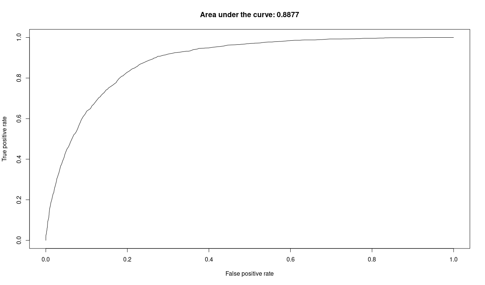
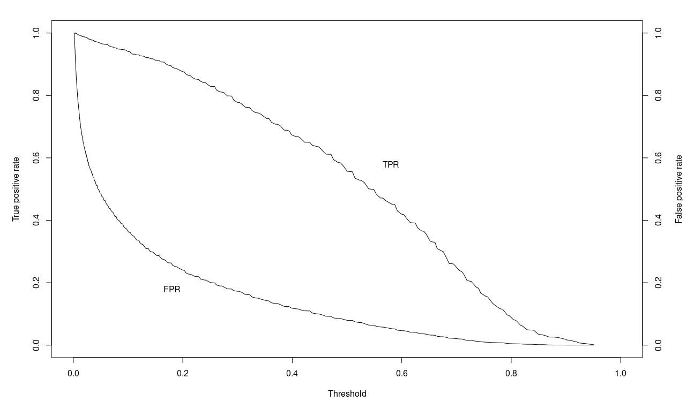

# lab5
## Task 1
```R
> #task1.r
> input = as.data.frame(read.csv("./income.csv"))
> input[1:10,]
   ID Income Age Education Gender
1   1    113  69        12      1
2   2     91  52        18      0
3   3    121  65        14      0
4   4     81  58        12      0
5   5     68  31        16      1
6   6     92  51        15      1
7   7     75  53        15      0
8   8     76  56        13      0
9   9     56  42        15      1
10 10     53  33        11      1
> Model_A <- lm(Income ~ Age + Education + Gender, input)
> summary(Model_A)

Call:
lm(formula = Income ~ Age + Education + Gender, data = input)

Residuals:
    Min      1Q  Median      3Q     Max 
-37.340  -8.101   0.139   7.885  37.271 

Coefficients:
            Estimate Std. Error t value Pr(>|t|)    
(Intercept)  7.26299    1.95575   3.714 0.000212 ***
Age          0.99520    0.02057  48.373  < 2e-16 ***
Education    1.75788    0.11581  15.179  < 2e-16 ***
Gender      -0.93433    0.62388  -1.498 0.134443    
---
Signif. codes:  0 ‘***’ 0.001 ‘**’ 0.01 ‘*’ 0.05 ‘.’ 0.1 ‘ ’ 1

Residual standard error: 12.07 on 1496 degrees of freedom
Multiple R-squared:  0.6364,	Adjusted R-squared:  0.6357 
F-statistic:   873 on 3 and 1496 DF,  p-value: < 2.2e-16

> Model_B <- lm(Income ~ Age + Education, input)
> summary(Model_B)

Call:
lm(formula = Income ~ Age + Education, data = input)

Residuals:
    Min      1Q  Median      3Q     Max 
-36.889  -7.892   0.185   8.200  37.740 

Coefficients:
            Estimate Std. Error t value Pr(>|t|)    
(Intercept)  6.75822    1.92728   3.507 0.000467 ***
Age          0.99603    0.02057  48.412  < 2e-16 ***
Education    1.75860    0.11586  15.179  < 2e-16 ***
---
Signif. codes:  0 ‘***’ 0.001 ‘**’ 0.01 ‘*’ 0.05 ‘.’ 0.1 ‘ ’ 1

Residual standard error: 12.08 on 1497 degrees of freedom
Multiple R-squared:  0.6359,	Adjusted R-squared:  0.6354 
F-statistic:  1307 on 2 and 1497 DF,  p-value: < 2.2e-16

> Age <- 41
> Education <- 12
> new_pt <- data.frame(Age, Education)
> conf_int <- predict(Model_B, new_pt, level = .95,interval = "confidence")
> conf_int
       fit      lwr      upr
1 68.69884 67.83102 69.56667
> pred_int <- predict(Model_B,new_pt,level=.95,interval="prediction")
> pred_int
       fit      lwr      upr
1 68.69884 44.98867 92.40902
```

## Task 2
```R
> #task2.r
> churn = as.data.frame(read.csv("./churn.csv"))
> head(churn)
  ID Churned Age Married Cust_years Churned_contacts
1  1       0  61       1          3                1
2  2       0  50       1          3                2
3  3       0  47       1          2                0
4  4       0  50       1          3                3
5  5       0  29       1          1                3
6  6       0  43       1          4                3
> sum(churn$Churned)
[1] 1743
> CModel_A <- glm (Churned~Age + Married + Cust_years + Churned_contacts, 
+                  data=churn, family=binomial(link="logit"))
> summary(CModel_A)

Call:
glm(formula = Churned ~ Age + Married + Cust_years + Churned_contacts, 
    family = binomial(link = "logit"), data = churn)

Deviance Residuals: 
    Min       1Q   Median       3Q      Max  
-2.4542  -0.5206  -0.1971  -0.0728   3.3786  

Coefficients:
                  Estimate Std. Error z value Pr(>|z|)    
(Intercept)       3.415201   0.163734  20.858   <2e-16 ***
Age              -0.156643   0.004088 -38.320   <2e-16 ***
Married           0.066432   0.068302   0.973    0.331    
Cust_years        0.017857   0.030497   0.586    0.558    
Churned_contacts  0.382324   0.027313  13.998   <2e-16 ***
---
Signif. codes:  0 ‘***’ 0.001 ‘**’ 0.01 ‘*’ 0.05 ‘.’ 0.1 ‘ ’ 1

(Dispersion parameter for binomial family taken to be 1)

    Null deviance: 8387.3  on 7999  degrees of freedom
Residual deviance: 5357.9  on 7995  degrees of freedom
AIC: 5367.9

Number of Fisher Scoring iterations: 6

> CModel_B <- glm (Churned~Age + Married + Churned_contacts,
+                  data=churn, family=binomial(link="logit"))
> summary(CModel_B)

Call:
glm(formula = Churned ~ Age + Married + Churned_contacts, family = binomial(link = "logit"), 
    data = churn)

Deviance Residuals: 
    Min       1Q   Median       3Q      Max  
-2.4476  -0.5178  -0.1972  -0.0723   3.3776  

Coefficients:
                  Estimate Std. Error z value Pr(>|z|)    
(Intercept)       3.472062   0.132107  26.282   <2e-16 ***
Age              -0.156635   0.004088 -38.318   <2e-16 ***
Married           0.066430   0.068299   0.973    0.331    
Churned_contacts  0.381909   0.027302  13.988   <2e-16 ***
---
Signif. codes:  0 ‘***’ 0.001 ‘**’ 0.01 ‘*’ 0.05 ‘.’ 0.1 ‘ ’ 1

(Dispersion parameter for binomial family taken to be 1)

    Null deviance: 8387.3  on 7999  degrees of freedom
Residual deviance: 5358.3  on 7996  degrees of freedom
AIC: 5366.3

Number of Fisher Scoring iterations: 6

> CModel_C <- glm (Churned~Age + Churned_contacts, 
+                  data=churn, family=binomial(link="logit"))
> summary(CModel_C)

Call:
glm(formula = Churned ~ Age + Churned_contacts, family = binomial(link = "logit"), 
    data = churn)

Deviance Residuals: 
    Min       1Q   Median       3Q      Max  
-2.4599  -0.5214  -0.1960  -0.0736   3.3671  

Coefficients:
                  Estimate Std. Error z value Pr(>|z|)    
(Intercept)       3.502716   0.128430   27.27   <2e-16 ***
Age              -0.156551   0.004085  -38.32   <2e-16 ***
Churned_contacts  0.381857   0.027297   13.99   <2e-16 ***
---
Signif. codes:  0 ‘***’ 0.001 ‘**’ 0.01 ‘*’ 0.05 ‘.’ 0.1 ‘ ’ 1

(Dispersion parameter for binomial family taken to be 1)

    Null deviance: 8387.3  on 7999  degrees of freedom
Residual deviance: 5359.2  on 7997  degrees of freedom
AIC: 5365.2

Number of Fisher Scoring iterations: 6

> library(ROCR)
> pred = predict(CModel_C, type="response")
> predObj = prediction(pred, churn$Churned )
> rocObj = performance(predObj, measure="tpr", x.measure="fpr")
> aucObj = performance(predObj, measure="auc")  
> plot(rocObj, main = paste("Area under the curve:", round(aucObj@y.values[[1]] ,4))) 
> alpha <- round(as.numeric(unlist(rocObj@alpha.values)),4)
> fpr <- round(as.numeric(unlist(rocObj@x.values)),4)
> tpr <- round(as.numeric(unlist(rocObj@y.values)),4)
> par(mar = c(5,5,2,5))
> plot(alpha,tpr, xlab="Threshold", xlim=c(0,1), ylab="True positive rate", type="l")
> par(new="True")
> plot(alpha,fpr, xlab="", ylab="", axes=F, xlim=c(0,1), type="l" )
> axis(side=4)
> mtext(side=4, line=3, "False positive rate")
> text(0.18,0.18,"FPR")
> text(0.58,0.58,"TPR")
> i <- which(round(alpha,2) == .5)
> paste("Threshold=" , (alpha[i]) , " TPR=" , tpr[i] , " FPR=" , fpr[i])
[1] "Threshold= 0.5004  TPR= 0.5571  FPR= 0.0793"
> i <- which(round(alpha,2) == .15)
```

