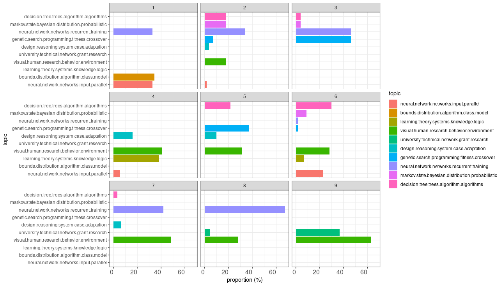
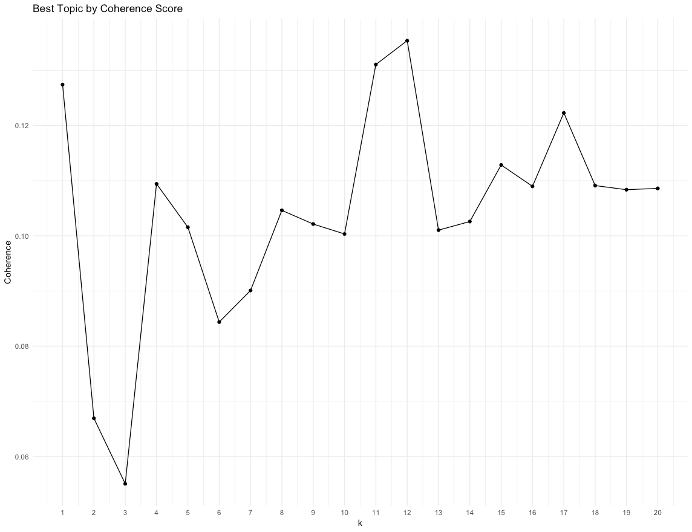
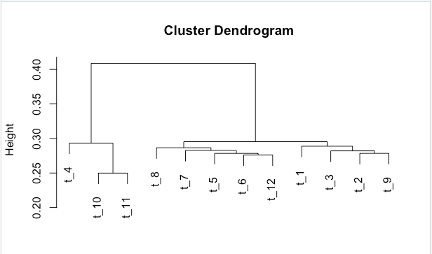

<!--
 * @Author: maywzh
 * @Date: 2020-11-11 01:02:38
 * @FilePath: /ji_coursenotes/2020fall/CSCI946/lab/lab7-1111/lab.md
-->

# Lab7
## Task 1
```R
require("ggplot2") 
require("reshape2") 
require("lda")

# load documents and vocabulary data(cora.documents) data(cora.vocab)
data(cora.documents)   
data(cora.vocab)  
theme_set(theme_bw())

# Number of topic clusters to display 
K <- 10

# Number of documents to display 
N <- 9

result <- lda.collapsed.gibbs.sampler(cora.documents, K, cora.vocab, 25, 0.1, 0.1, compute.log.likelihood=TRUE)

# Get the top words in the cluster 
top.words <- top.topic.words(result$topics, 5, by.score=TRUE)

# build topic proportions 
topic.props <- t(result$document_sums)/colSums(result$document_sums)

document.samples <- sample(1:dim(topic.props)[1], N) 
topic.props <- topic.props[document.samples,]

topic.props[is.na(topic.props)] <- 1/K

colnames(topic.props) <- apply(top.words, 2, paste, collapse=" ")

topic.props.df <- melt(cbind(data.frame(topic.props), document=factor(1:N)), variable.name="topic", id.vars = "document")

qplot(topic, value*100, fill=topic, stat="identity", ylab="proportion (%)", data=topic.props.df, geom="col") + theme(axis.text.x = element_text(angle=0, hjust=1, size=12)) + coord_flip() + facet_wrap(~ document, ncol=3)


```


## Task 2
```R
#----Loading of data----

# Install
install.packages("tm")  # for text mining
install.packages("SnowballC") # for text stemming
install.packages("wordcloud") # word-cloud generator 
install.packages("RColorBrewer") # color palettes

# Load
library("tm")
library("SnowballC")
library("wordcloud")
library("RColorBrewer")
library(stringr)

library('data.table')
library(dplyr)
data <- fread('Sentiment.csv')
#data <- data %>% select(text,id) %>% head(5000)


#---- Pre-processing----
data$text <- sub("RT.*:", "", data$text)
data$text <- sub("@.* ", "", data$text)
text_cleaning_tokens <- data %>% 
  tidytext::unnest_tokens(word, text)
text_cleaning_tokens$word <- gsub('[[:digit:]]+', '', text_cleaning_tokens$word)
text_cleaning_tokens$word <- gsub('[[:punct:]]+', '', text_cleaning_tokens$word)
text_cleaning_tokens <- text_cleaning_tokens %>% filter(!(nchar(word) == 1))%>% 
  anti_join(stop_words)
tokens <- text_cleaning_tokens %>% filter(!(word==""))
tokens <- tokens %>% mutate(ind = row_number())
tokens <- tokens %>% group_by(id) %>% mutate(ind = row_number()) %>%
  tidyr::spread(key = ind, value = word)
tokens [is.na(tokens)] <- ""
tokens <- tidyr::unite(tokens, text,-id,sep =" " )
tokens$text <- trimws(tokens$text)


#----Model Building----
#create DTM
dtm <- CreateDtm(tokens$text, 
                 doc_names = tokens$ID, 
                 ngram_window = c(1, 2))
#explore the basic frequency
tf <- TermDocFreq(dtm = dtm)
original_tf <- tf %>% select(term, term_freq,doc_freq)
rownames(original_tf) <- 1:nrow(original_tf)
# Eliminate words appearing less than 2 times or in more than half of the
# documents
vocabulary <- tf$term[ tf$term_freq > 1 & tf$doc_freq < nrow(dtm) / 2 ]
dtm = dtm


k_list <- seq(1, 20, by = 1)
model_dir <- paste0("models_", digest::digest(vocabulary, algo = "sha1"))
if (!dir.exists(model_dir)) dir.create(model_dir)
model_list <- TmParallelApply(X = k_list, FUN = function(k){
  filename = file.path(model_dir, paste0(k, "_topics.rda"))
  
  if (!file.exists(filename)) {
    m <- FitLdaModel(dtm = dtm, k = k, iterations = 500)
    m$k <- k
    m$coherence <- CalcProbCoherence(phi = m$phi, dtm = dtm, M = 5)
    save(m, file = filename)
  } else {
    load(filename)
  }
  
  m
}, export=c("dtm", "model_dir")) # export only needed for Windows machines
#model tuning
#choosing the best model
coherence_mat <- data.frame(k = sapply(model_list, function(x) nrow(x$phi)), 
                            coherence = sapply(model_list, function(x) mean(x$coherence)), 
                            stringsAsFactors = FALSE)
ggplot(coherence_mat, aes(x = k, y = coherence)) +
  geom_point() +
  geom_line(group = 1)+
  ggtitle("Best Topic by Coherence Score") + theme_minimal() +
  scale_x_continuous(breaks = seq(1,20,1)) + ylab("Coherence")


model <- model_list[which.max(coherence_mat$coherence)][[ 1 ]]
model$top_terms <- GetTopTerms(phi = model$phi, M = 20)
top20_wide <- as.data.frame(model$top_terms)


model$topic_linguistic_dist <- CalcHellingerDist(model$phi)
model$hclust <- hclust(as.dist(model$topic_linguistic_dist), "ward.D")
model$hclust$labels <- paste(model$hclust$labels, model$labels[ , 1])
plot(model$hclust)


#visualising topics of words based on the max value of phi
set.seed(1234)
final_summary_words <- data.frame(top_terms = t(model$top_terms))
final_summary_words$topic <- rownames(final_summary_words)
rownames(final_summary_words) <- 1:nrow(final_summary_words)
final_summary_words <- final_summary_words %>% melt(id.vars = c("topic"))
final_summary_words <- final_summary_words %>% rename(word = value) %>% select(-variable)
final_summary_words <- left_join(final_summary_words,allterms)
final_summary_words <- final_summary_words %>% group_by(topic,word) %>%
  arrange(desc(value))
final_summary_words <- final_summary_words %>% group_by(topic, word) %>% filter(row_number() == 1) %>% 
  ungroup() %>% tidyr::separate(topic, into =c("t","topic")) %>% select(-t)
word_topic_freq <- left_join(final_summary_words, original_tf, by = c("word" = "term"))
pdf("cluster.pdf")
for(i in 1:length(unique(final_summary_words$topic)))
{  wordcloud(words = subset(final_summary_words ,topic == i)$word, freq = subset(final_summary_words ,topic == i)$value, min.freq = 1,
             max.words=200, random.order=FALSE, rot.per=0.35, 
             colors=brewer.pal(8, "Dark2"))}
dev.off()
```





