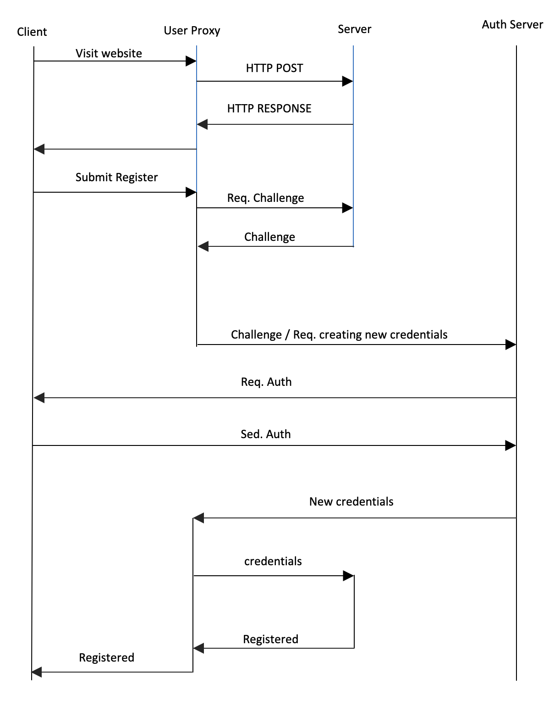
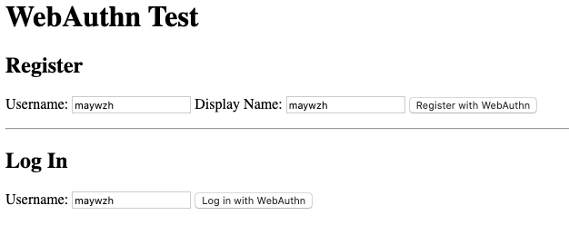
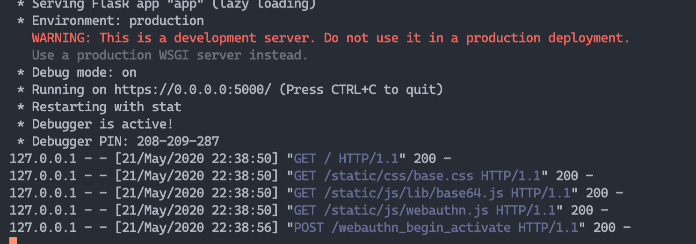

# Project Report

## Requirement analysis 
In this task, we need to add the identification protocol to the VPN service. 

We already know that the public key of the proxy server is known to the client in advance. Here we take advantage of the FIDO2 protocol (WebAuthn  standard) for  the identification. Local biometric authentication is required to unlock the private key according to the FIDO2 specification. (We use Pincode instead.)


## Related techniques
### WebAuth
[Web authentication](https://www.w3.org/TR/webauthn/) is formulated by the W3C and FIDO alliance. Currently, only under Windows 10 and Android, there are three mainstream browsers Chrome, Edge, and Firefox. Native support, you can use the platform authenticator (that is, built-in PC) or roaming authenticator (such as mobile phones, tablets, smart watches, etc.), call the FIDO service through the WebAuthn interface to complete the strong identity authentication of Web applications.

Of course, because of the generality of the W3C standard, not only browsers, but any Web application, such as a mobile application developed using html5 language, can call this interface. There are two advantages. First, developers of web applications through the WebAuthn interface can more easily call FIDO services with a unified standard. Second, the scenarios supported by FIDO2's strong identity authentication capabilities can be extended more widely through browsers and web applications. .

### VPN
VPN is a virtual private line out of the enterprise. Through a specially encrypted communication protocol, a dedicated communication line is established for two or more enterprise intranets connected to the Internet at different locations, just like setting up a dedicated line, but there is no need to really screen optical cables or the like Physical circuit.

VPN consists of VPN server, VPN connection (Internet public network), protocol tunnel, and VPN client.

## Protocol 
Here is the detail of the protocol.


### Register

Firstly, user visit the website (Get the front-end user interface) and then submit register form through front-end client to back-end server. Then, server generate challenge assembled with a uuid and send it to client. The client then choose one way to authenticate the register, which user send challenge request to Authenticate server. The Auth server then request user to verify the indetification by the biometrics or pincode way. The Auth server then generate private key $sk$ and public key $pk$ , and store $sk$ with uuid and user submitted information. The private key is to sigh the challenge, which should be send back to user client. After that, user should received the Authenticated  infomation and send them to server. The server check the information and use $pk$ to decrypt them, comparing with info received previously.


### Login
This is the register/login interface 



This is the server output



## Code

### Authenticator
```go
type User struct {
	Name           string                    `json:"name"`
	Authenticators map[string]*Authenticator `json:"-"`
}

type Authenticator struct {
	User         *User
	ID           []byte
	CredentialID []byte
	PublicKey    []byte
	AAGUID       []byte
	SignCount    uint32
}

type Storage struct {
	users          map[string]*User
	authenticators map[string]*Authenticator
}

func (s *Storage) AddAuthenticator(user webauthn.User, authenticator webauthn.Authenticator) error {
	authr := &Authenticator{
		ID:           authenticator.WebAuthID(),
		CredentialID: authenticator.WebAuthCredentialID(),
		PublicKey:    authenticator.WebAuthPublicKey(),
		AAGUID:       authenticator.WebAuthAAGUID(),
		SignCount:    authenticator.WebAuthSignCount(),
	}
	key := hex.EncodeToString(authr.ID)

	u, ok := s.users[string(user.WebAuthID())]
	if !ok {
		return fmt.Errorf("user not found")
	}

	if _, ok := s.authenticators[key]; ok {
		return fmt.Errorf("authenticator already exists")
	}

	authr.User = u

	u.Authenticators[key] = authr
	s.authenticators[key] = authr

	return nil
}

func (s *Storage) GetAuthenticator(id []byte) (webauthn.Authenticator, error) {
	authr, ok := s.authenticators[hex.EncodeToString(id)]
	if !ok {
		return nil, fmt.Errorf("authenticator not found")
	}
	return authr, nil
}

func (s *Storage) GetAuthenticators(user webauthn.User) ([]webauthn.Authenticator, error) {
	u, ok := s.users[string(user.WebAuthID())]
	if !ok {
		return nil, fmt.Errorf("user not found")
	}

	var authrs []webauthn.Authenticator
	for _, v := range u.Authenticators {
		authrs = append(authrs, v)
	}
	return authrs, nil
}

func (u *User) WebAuthID() []byte {
	return []byte(u.Name)
}

func (u *User) WebAuthName() string {
	return u.Name
}

func (u *User) WebAuthDisplayName() string {
	return u.Name
}

func (a *Authenticator) WebAuthID() []byte {
	return a.ID
}

func (a *Authenticator) WebAuthCredentialID() []byte {
	return a.CredentialID
}

func (a *Authenticator) WebAuthPublicKey() []byte {
	return a.PublicKey
}

func (a *Authenticator) WebAuthAAGUID() []byte {
	return a.AAGUID
}

func (a *Authenticator) WebAuthSignCount() uint32 {
	return a.SignCount
}


```

Session, keep the login state.
```go
package main

import (
	"github.com/gorilla/sessions"
	"github.com/labstack/echo-contrib/session"
	"github.com/labstack/echo/v4"
)

var contextKeySession = "webauthn-demo-session"

func SessionMiddleware(next echo.HandlerFunc) echo.HandlerFunc {
	return func(c echo.Context) error {
		sess, _ := session.Get("session", c)
		sess.Options = &sessions.Options{
			Path:     "/",
			MaxAge:   2592000, // 30 days
			HttpOnly: true,
		}
		c.Set(contextKeySession, sess)

		c.Response().Before(func() {
			sess.Save(c.Request(), c.Response())
		})

		err := next(c)

		c.Set(contextKeySession, nil)

		return err
	}
}

func SessionFromContext(c echo.Context) *sessions.Session {
	sess, ok := c.Get(contextKeySession).(*sessions.Session)
	if !ok {
		return nil
	}
	return sess
}
```