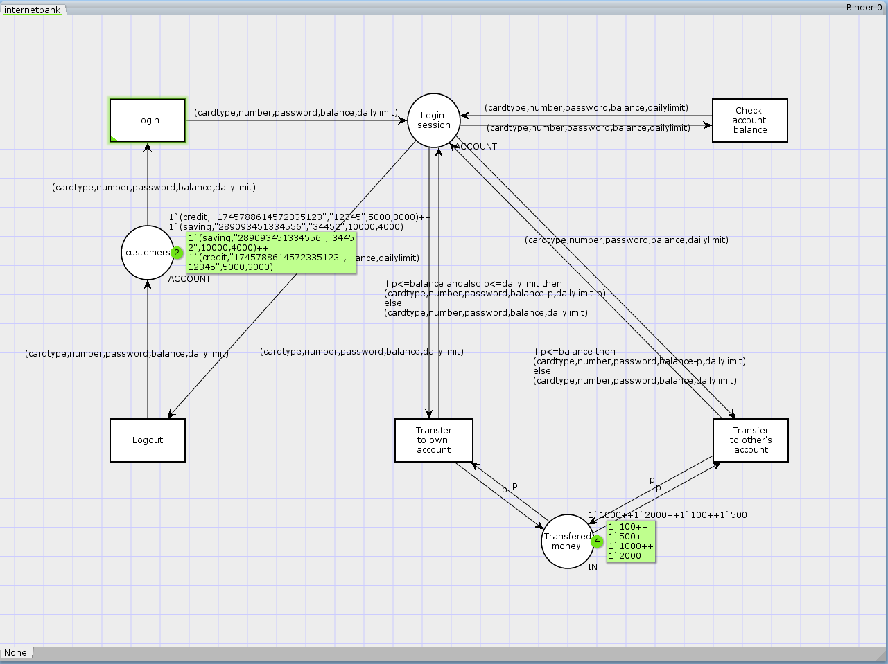

# Colored Petri net

## Graph



### Mathematic representation

$C=(P,T,I,O)$

$P=\{Customer, Login\_session, Transfered\_money\}$

$T=\{Login, Check\_account\_balance, Transfer\_to\_others\_account, Transfer\_to\_own\_account, Logout\}$

$I(Login)=\{Customer\}$  
$O(Login)=\{Login\_session\}$

$I(Check\_account\_balance)=\{Login\_session\}$  
$O(Check\_account\_balance)=\{Login\_session\}$

$I(Transfer\_to\_others\_account)=\{Login\_session, Transfered\_money\}$  
$O(Transfer\_to\_others\_account)=\{Login\_session, Transfered\_money\}$

$I(Transfer\_to\_own\_account)=\{Login\_session, Transfered\_money\}$  
$O(Transfer\_to\_own\_account)=\{Login\_session, Transfered\_money\}$

$I(Logout)=\{Login\_session\}$  
$O(Logout)=\{Customer\}$

Initial marking is $\mu=\{2,0,4\}$


## Definition of all colsets

```ML
colset NUMBER= string;
colset PASSWORD = string;
colset BALANCE =int;
colset DAILYLIMIT=int;
colset CARDTYPE = with saving|credit;
colset ACCOUNT=product CARDTYPE*NUMBER*PASSWORD
*BALANCE*DAILYLIMIT;
var number:NUMBER;
var password:PASSWORD;
var balance:BALANCE;
var dailylimit:DAILYLIMIT;
var cardtype:CARDTYPE;
var p:BALANCE;
```

#### Explaination

There are 2 customers to login to the system in the begining, and there are four denominations(i.e. 100,500,1000,2000) to choose from during the transfer process. When a customer finish checking balance or transferring, he can perform checking or transferring again before logout the system.